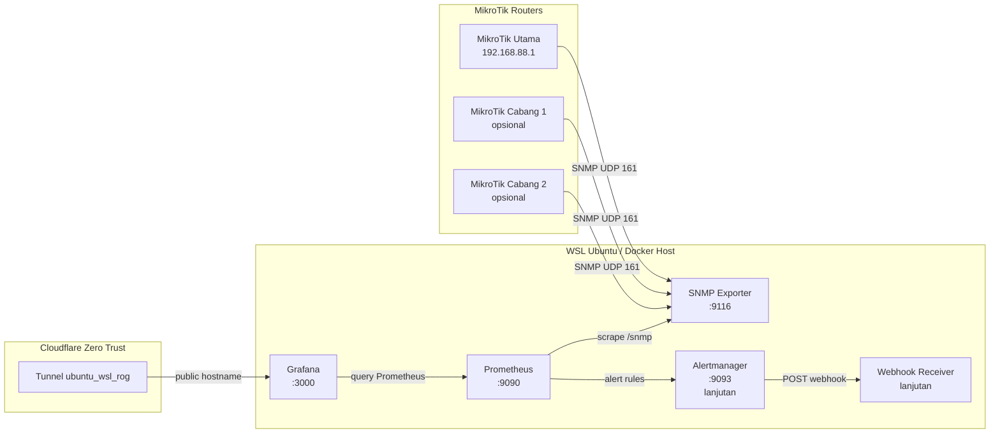

# Dashboard Observability Multi-Router MikroTik Berbasis Prometheus, Grafana, dan Automated Alerting Webhook

Dokumentasi ini menjelaskan langkah teknis pembuatan project monitoring jaringan MikroTik menggunakan **Docker**, **SNMP Exporter**, **Prometheus**, **Grafana**, dan rencana lanjutan **Alertmanager + Webhook**.


> **Update terbaru:** project sudah ditingkatkan dari sekadar dashboard monitoring menjadi sistem **monitoring + automated alerting**. Alert otomatis sekarang dapat dikirim ke **Telegram Bot** melalui alur **Prometheus Alert Rules → Alertmanager → FastAPI Webhook Receiver → Telegram Group**. Semua data runtime penting disimpan memakai **bind mount ke folder project/server**, bukan Docker named volume tersembunyi.


Project ini dibuat untuk kebutuhan monitoring multi-router MikroTik, dimulai dari satu router MikroTik utama:

```text
MikroTik utama : 192.168.88.1
RouterOS       : v6.49.9
Device         : MikroTik RB941-2nD / hAP lite
Environment    : WSL Ubuntu di laptop
Reverse proxy  : Cloudflare Zero Trust Tunnel
Tunnel name    : ubuntu_wsl_rog
```

---

## 1. Tujuan Project

Tujuan utama project ini adalah membuat sistem observability untuk router MikroTik yang mampu:

1. Membaca data router MikroTik menggunakan SNMP.
2. Mengubah data SNMP menjadi metrics Prometheus menggunakan SNMP Exporter.
3. Menyimpan metrics time-series di Prometheus.
4. Menampilkan dashboard visual di Grafana.
5. Mendukung monitoring banyak router MikroTik.
6. Menambahkan alert otomatis jika router/interface bermasalah.
7. Mengirim alert melalui webhook ke Telegram, WhatsApp, email, atau sistem lain.

---

## 2. Skema Arsitektur



Alur sederhananya:

```text
MikroTik 192.168.88.1
        ↓ SNMP UDP 161
SNMP Exporter
        ↓ HTTP metrics
Prometheus
        ↓ query
Grafana Dashboard
        ↓ tahap lanjutan
Alertmanager + Webhook
```

---

## 3. Komponen yang Digunakan

| Komponen | Fungsi |
|---|---|
| MikroTik | Router yang dimonitor |
| SNMP | Protokol untuk membaca data perangkat jaringan |
| SNMP Exporter | Mengubah data SNMP menjadi metrics format Prometheus |
| Prometheus | Menyimpan metrics dan melakukan scraping berkala |
| Grafana | Menampilkan dashboard monitoring |
| Alertmanager | Mengatur dan mengirim alert, tahap lanjutan |
| Webhook Receiver | Menerima alert dan meneruskan ke Telegram/WhatsApp/email, tahap lanjutan |
| Docker Compose | Menjalankan semua service dengan rapi |
| Cloudflare Zero Trust | Membuat Grafana bisa diakses online tanpa membuka port publik langsung |

---

## 4. Struktur Folder Project

Struktur folder yang digunakan:

```text
grafana_monitoring_mikrotik/
├── docker-compose.yml
├── prometheus/
│   └── prometheus.yml
├── snmp-exporter/
│   └── snmp.yml
├── grafana/
│   ├── data/
│   │   └── grafana.db
│   ├── dashboards/
│   │   └── dashboard-mikrotik.json
│   └── provisioning/
│       ├── datasources/
│       │   └── prometheus.yml
│       └── dashboards/
│           └── mikrotik-dashboard.yml
├── hasil/
│   ├── grafana_proses.png
│   ├── prometheus_targets_job.png
│   └── wujud_asli_mikrotik.jpeg
├── penjelasan_dari_awal.md
└── README.md
```

File yang wajib ada untuk menjalankan stack:

```text
docker-compose.yml
prometheus/prometheus.yml
snmp-exporter/snmp.yml
```

File/folder penting untuk menjaga tampilan Grafana tetap aman saat pindah device:

```text
grafana/data/grafana.db
grafana/provisioning/datasources/prometheus.yml
grafana/provisioning/dashboards/mikrotik-dashboard.yml
grafana/dashboards/dashboard-mikrotik.json
```

Catatan:

- `grafana/data/grafana.db` menyimpan dashboard, panel, query, threshold, datasource, user, dan konfigurasi internal Grafana.
- `grafana/provisioning/` digunakan agar datasource dan dashboard bisa otomatis terbaca saat container Grafana dibuat ulang.
- `grafana/dashboards/` digunakan untuk menyimpan dashboard JSON agar mudah dipindahkan atau di-restore.
- Untuk repository publik, folder `grafana/data/` sebaiknya dimasukkan ke `.gitignore` karena berisi database internal Grafana.
```gitignore
grafana/data/
```

---

## 5. Persiapan MikroTik

### 5.1 Cek IP MikroTik

Dari WinBox, buka:

```text
IP > Addresses
```

Pada project ini, IP utama MikroTik yang digunakan adalah:

```text
192.168.88.1
```

Pastikan IP tersebut bisa diakses dari WSL Ubuntu.

Dari WSL Ubuntu:

```bash
ping -c 4 192.168.88.1
```

Contoh hasil berhasil:

```text
64 bytes from 192.168.88.1: icmp_seq=1 ttl=63 time=0.598 ms
64 bytes from 192.168.88.1: icmp_seq=2 ttl=63 time=0.537 ms
64 bytes from 192.168.88.1: icmp_seq=3 ttl=63 time=0.640 ms
64 bytes from 192.168.88.1: icmp_seq=4 ttl=63 time=0.474 ms

4 packets transmitted, 4 received, 0% packet loss
```

Jika ping berhasil, artinya WSL Ubuntu sudah bisa menjangkau MikroTik.

---

### 5.2 Aktifkan SNMP di MikroTik

Masuk ke WinBox, lalu buka:

```text
New Terminal
```

Jalankan:

```rsc
/snmp set enabled=yes contact="admin" location="Lab Monitoring MikroTik"
```

Cek status SNMP:

```rsc
/snmp print
```

---

### 5.3 Buat Community SNMP

Untuk kebutuhan monitoring, gunakan community read-only.

Contoh community:

```text
monitoring123
```

Jalankan di terminal MikroTik:

```rsc
/snmp community add name=monitoring123 addresses=192.168.88.0/24 read-access=yes write-access=no
```

Jika muncul error seperti ini:

```text
failure: community with the same name already exists!
```

Artinya community tersebut sudah pernah dibuat. Maka cukup update saja:

```rsc
/snmp community set [find name="monitoring123"] addresses=192.168.88.0/24 read-access=yes write-access=no
```

Cek detail community:

```rsc
/snmp community print detail
```

---

### 5.4 Firewall MikroTik untuk SNMP

Jika firewall MikroTik aktif, izinkan SNMP dari jaringan lokal:

```rsc
/ip firewall filter add chain=input protocol=udp dst-port=161 src-address=192.168.88.0/24 action=accept comment="Allow SNMP from monitoring subnet"
```

Catatan:

- SNMP menggunakan port **UDP 161**.
- Jangan membuka SNMP ke publik.
- Batasi hanya dari IP/jaringan monitoring.

Untuk testing sementara bisa memakai:

```rsc
/snmp community set [find name="monitoring123"] addresses=0.0.0.0/0 read-access=yes write-access=no
```

Namun setelah berhasil, sebaiknya dikunci kembali ke subnet lokal:

```rsc
/snmp community set [find name="monitoring123"] addresses=192.168.88.0/24 read-access=yes write-access=no
```

---

## 6. Persiapan WSL Ubuntu

### 6.1 Masuk ke folder project

```bash
cd ~/grafana_monitoring_mikrotik
```

Jika folder belum ada:

```bash
mkdir -p ~/grafana_monitoring_mikrotik
cd ~/grafana_monitoring_mikrotik
```

---

### 6.2 Install tool SNMP untuk testing

```bash
sudo apt update
sudo apt install -y snmp
```

Jika `apt update` bermasalah karena IPv6, paksa APT menggunakan IPv4:

```bash
echo 'Acquire::ForceIPv4 "true";' | sudo tee /etc/apt/apt.conf.d/99force-ipv4
sudo apt update
```

---

### 6.3 Test SNMP dari WSL ke MikroTik

Jalankan:

```bash
snmpwalk -v2c -c monitoring123 192.168.88.1 1.3.6.1.2.1.1.1.0
```

Jika berhasil, output akan seperti ini:

```text
iso.3.6.1.2.1.1.1.0 = STRING: "RouterOS RB941-2nD"
```

Jika output tersebut muncul, artinya:

```text
WSL Ubuntu → MikroTik SNMP = BERHASIL
```

---

## 7. Setup Docker Compose

### 7.1 Buat folder config

```bash
mkdir -p prometheus snmp-exporter grafana
```

---

### 7.2 Buat file docker-compose.yml

Buat file:

```bash
nano docker-compose.yml
```

Isi dengan konfigurasi berikut:

```yaml
services:
  snmp_exporter:
    image: prom/snmp-exporter:latest
    container_name: mikrotik_snmp_exporter
    restart: unless-stopped
    ports:
      - "9116:9116"
    volumes:
      - ./snmp-exporter/snmp.yml:/etc/snmp_exporter/snmp.yml:ro

  prometheus:
    image: prom/prometheus:latest
    container_name: mikrotik_prometheus
    restart: unless-stopped
    ports:
      - "9090:9090"
    command:
      - "--config.file=/etc/prometheus/prometheus.yml"
      - "--storage.tsdb.retention.time=30d"
    volumes:
      - ./prometheus/prometheus.yml:/etc/prometheus/prometheus.yml:ro
      - prometheus_data:/prometheus
    depends_on:
      - snmp_exporter

  grafana:
    image: grafana/grafana:latest
    container_name: mikrotik_grafana
    restart: unless-stopped
    ports:
      - "3000:3000"
    environment:
      - GF_SECURITY_ADMIN_USER=admin
      - GF_SECURITY_ADMIN_PASSWORD=admin12345
      - GF_USERS_ALLOW_SIGN_UP=false
    volumes:
      # Data Grafana dibuat bind mount ke folder project agar dashboard tidak hilang
      # dan mudah dipindahkan ke device lain.
      - ./grafana/data:/var/lib/grafana

      # Provisioning agar datasource dan dashboard bisa dibaca otomatis.
      - ./grafana/provisioning:/etc/grafana/provisioning:ro
      - ./grafana/dashboards:/var/lib/grafana/dashboards:ro
    depends_on:
      - prometheus

volumes:
  prometheus_data:
```

Catatan penting:

- Dengan konfigurasi `./grafana/data:/var/lib/grafana`, data Grafana tidak hanya tersimpan di Docker volume, tetapi masuk ke folder project.
- File utama yang menandakan backup Grafana berhasil adalah `grafana/data/grafana.db`.
- `docker compose down` aman.
- Jangan membiasakan `docker compose down -v` karena dapat menghapus named volume seperti `prometheus_data`.
```

Port yang digunakan:

| Service | Port |
|---|---|
| SNMP Exporter | 9116 |
| Prometheus | 9090 |
| Grafana | 3000 |

---

## 8. Setup SNMP Exporter

### 8.1 Ambil file snmp.yml default dari image Docker

Jalankan:

```bash
docker run --rm --entrypoint cat prom/snmp-exporter:latest /etc/snmp_exporter/snmp.yml > snmp-exporter/snmp.yml
```

Cek file:

```bash
ls -lh snmp-exporter/snmp.yml
head -40 snmp-exporter/snmp.yml
```

Jika file berhasil dibuat, ukurannya biasanya cukup besar karena berisi banyak module SNMP.

---

### 8.2 Ubah community public menjadi monitoring123

Jalankan:

```bash
sed -i '0,/community: public/s/community: public/community: monitoring123/' snmp-exporter/snmp.yml
```

Cek hasilnya:

```bash
grep -n "community:" snmp-exporter/snmp.yml | head
```

Output yang diharapkan:

```text
4:    community: monitoring123
10:    community: public
```

Keterangan:

- `public_v1` berubah menjadi `monitoring123`.
- `public_v2` masih public jika hanya baris pertama yang diganti.

Agar lebih rapi, ubah juga bagian `public_v2` secara manual.

Edit file:

```bash
nano snmp-exporter/snmp.yml
```

Cari bagian:

```yaml
auths:
  public_v1:
    community: monitoring123
    security_level: noAuthNoPriv
    auth_protocol: MD5
    priv_protocol: DES
    version: 1
  public_v2:
    community: public
    security_level: noAuthNoPriv
    auth_protocol: MD5
    priv_protocol: DES
    version: 2
```

Ubah menjadi:

```yaml
auths:
  public_v1:
    community: monitoring123
    security_level: noAuthNoPriv
    auth_protocol: MD5
    priv_protocol: DES
    version: 1
  public_v2:
    community: monitoring123
    security_level: noAuthNoPriv
    auth_protocol: MD5
    priv_protocol: DES
    version: 2
```

Simpan file.

---

## 9. Setup Prometheus

Buat file:

```bash
nano prometheus/prometheus.yml
```

Isi:

```yaml
global:
  scrape_interval: 15s
  evaluation_interval: 15s

scrape_configs:
  - job_name: "prometheus"
    static_configs:
      - targets:
          - "prometheus:9090"

  - job_name: "mikrotik_snmp"
    metrics_path: /snmp
    params:
      module:
        - if_mib
      auth:
        - public_v2
    static_configs:
      - targets:
          - 192.168.88.1
        labels:
          router: "mikrotik_hap_lite"
          location: "lab_wsl"
    relabel_configs:
      - source_labels: [__address__]
        target_label: __param_target

      - source_labels: [__param_target]
        target_label: instance

      - target_label: __address__
        replacement: snmp_exporter:9116
```

Penjelasan penting:

```yaml
targets:
  - 192.168.88.1
```

Itu adalah IP MikroTik yang dimonitor.

```yaml
replacement: snmp_exporter:9116
```

Artinya Prometheus tidak langsung scrape MikroTik, tetapi scrape ke SNMP Exporter.

Alurnya:

```text
Prometheus → snmp_exporter:9116/snmp?target=192.168.88.1
```

---

## 10. Jalankan Docker Stack

Jalankan:

```bash
docker compose up -d
```

Cek container:

```bash
docker ps
```

Container yang harus aktif:

```text
mikrotik_snmp_exporter
mikrotik_prometheus
mikrotik_grafana
```

Cek log jika perlu:

```bash
docker logs mikrotik_snmp_exporter --tail=50
docker logs mikrotik_prometheus --tail=50
docker logs mikrotik_grafana --tail=50
```

---

## 11. Test SNMP Exporter

Dari WSL:

```bash
curl "http://localhost:9116/snmp?target=192.168.88.1&module=if_mib&auth=public_v2" | head
```

Contoh output berhasil:

```text
# HELP ifAdminStatus The desired state of the interface
# TYPE ifAdminStatus gauge
ifAdminStatus{ifAlias="",ifDescr="ether1",ifIndex="1",ifName="ether1"} 1
ifAdminStatus{ifAlias="",ifDescr="ether2",ifIndex="2",ifName="ether2"} 1
ifAdminStatus{ifAlias="",ifDescr="ether3",ifIndex="3",ifName="ether3"} 1
ifAdminStatus{ifAlias="",ifDescr="ether4",ifIndex="4",ifName="ether4"} 1
ifAdminStatus{ifAlias="",ifDescr="pwr-line1",ifIndex="5",ifName="pwr-line1"} 1
ifAdminStatus{ifAlias="",ifDescr="wlan1",ifIndex="6",ifName="wlan1"} 2
```

Jika muncul pesan:

```text
curl: Failed writing body
```

Saat menggunakan `| head`, itu normal. Penyebabnya output metrics masih banyak, tetapi command `head` sudah menutup output.

---

## 12. Cek Prometheus

Buka browser:

```text
http://localhost:9090/targets
```

Pastikan target berikut statusnya **UP**:

```text
mikrotik_snmp
prometheus
```

Jika `mikrotik_snmp` sudah UP, artinya pipeline ini sudah berhasil:

```text
MikroTik → SNMP Exporter → Prometheus
```

Coba query di Prometheus:

```promql
up{job="mikrotik_snmp"}
```

Output yang diharapkan:

```text
1
```

---

## 13. Setup Grafana

### 13.1 Buka Grafana

Buka:

```text
http://localhost:3000
```

Login default:

```text
username: admin
password: admin12345
```

Sebaiknya setelah login, ganti password admin agar lebih aman.

---

### 13.2 Tambahkan Data Source Prometheus

Masuk ke menu:

```text
Connections > Data sources > Add data source
```

Pilih:

```text
Prometheus
```

Isi bagian Prometheus server URL:

```text
http://prometheus:9090
```

Penting:

Jangan memakai:

```text
http://localhost:9090
```

Alasannya:

```text
Grafana berjalan di dalam container.
Jika diisi localhost, maka localhost tersebut mengarah ke container Grafana,
bukan ke container Prometheus.
```

Karena container berada dalam satu network Docker Compose, Grafana harus mengakses Prometheus menggunakan nama service:

```text
http://prometheus:9090
```

Klik:

```text
Save & test
```

Jika berhasil, akan muncul pesan bahwa Grafana berhasil query Prometheus API.

---

## 14. Membuat Dashboard Grafana

Buat dashboard baru:

```text
Dashboards > New > New Dashboard
```

Nama dashboard:

```text
DASHBOARD MIKROTIK
```

---

### 14.1 Panel Status Router MikroTik

Query:

```promql
up{job="mikrotik_snmp"}
```

Visualization:

```text
Stat
```

Judul:

```text
Status Router MikroTik
```

Value mapping:

```text
1 = ONLINE
0 = DOWN
```

---

### 14.2 Panel Total Download Traffic

Query:

```promql
sum(rate(ifHCInOctets{job="mikrotik_snmp"}[5m]) * 8)
```

Visualization:

```text
Stat
```

Unit:

```text
bits/sec
```

Judul:

```text
Total Download Traffic
```

---

### 14.3 Panel Total Upload Traffic

Query:

```promql
sum(rate(ifHCOutOctets{job="mikrotik_snmp"}[5m]) * 8)
```

Visualization:

```text
Stat
```

Unit:

```text
bits/sec
```

Judul:

```text
Total Upload Traffic
```

---

### 14.4 Panel Download per Interface

Query:

```promql
rate(ifHCInOctets{job="mikrotik_snmp"}[5m]) * 8
```

Visualization:

```text
Time series
```

Unit:

```text
bits/sec
```

Legend:

```text
{{ifName}}
```

Judul:

```text
Download per Interface
```

---

### 14.5 Panel Upload per Interface

Query:

```promql
rate(ifHCOutOctets{job="mikrotik_snmp"}[5m]) * 8
```

Visualization:

```text
Time series
```

Unit:

```text
bits/sec
```

Legend:

```text
{{ifName}}
```

Judul:

```text
Upload per Interface
```

---

### 14.6 Panel Status Interface

Query:

```promql
ifOperStatus{job="mikrotik_snmp"}
```

Visualization:

```text
Table
```

Judul:

```text
Status Interface
```

Nilai:

```text
1 = UP
2 = DOWN
```

Jika ingin hanya melihat interface tertentu:

```promql
ifOperStatus{job="mikrotik_snmp", ifName="ether1"}
```

Atau untuk semua ethernet:

```promql
ifOperStatus{job="mikrotik_snmp", ifName=~"ether.*"}
```

---

## 15. Susunan Dashboard yang Disarankan

Layout awal:

```text
Baris 1:
[Status Router MikroTik] [Total Download Traffic] [Total Upload Traffic]

Baris 2:
[Status Interface]

Baris 3:
[Download per Interface]

Baris 4:
[Upload per Interface]
```

Jika ingin lebih rapi:

- Gunakan panel `Stat` untuk status dan total traffic.
- Gunakan `Time series` untuk traffic per interface.
- Gunakan `Table` untuk status interface.
- Gunakan legend `{{ifName}}`.
- Set unit traffic menjadi `bits/sec`.

---

## 16. Query PromQL Penting

### Status router

```promql
up{job="mikrotik_snmp"}
```

### Download per interface

```promql
rate(ifHCInOctets{job="mikrotik_snmp"}[5m]) * 8
```

### Upload per interface

```promql
rate(ifHCOutOctets{job="mikrotik_snmp"}[5m]) * 8
```

### Total download semua interface

```promql
sum(rate(ifHCInOctets{job="mikrotik_snmp"}[5m]) * 8)
```

### Total upload semua interface

```promql
sum(rate(ifHCOutOctets{job="mikrotik_snmp"}[5m]) * 8)
```

### Status interface

```promql
ifOperStatus{job="mikrotik_snmp"}
```

### Interface yang down

```promql
ifOperStatus{job="mikrotik_snmp"} == 2
```

### Traffic ether1 download

```promql
rate(ifHCInOctets{job="mikrotik_snmp", ifName="ether1"}[5m]) * 8
```

### Traffic ether1 upload

```promql
rate(ifHCOutOctets{job="mikrotik_snmp", ifName="ether1"}[5m]) * 8
```

---

## 17. Cloudflare Zero Trust

Pada project ini WSL Ubuntu sudah dihubungkan ke Cloudflare Zero Trust menggunakan tunnel:

```text
ubuntu_wsl_rog
```

Yang sebaiknya di-expose ke internet hanya Grafana:

```text
Service type : HTTP
URL          : http://localhost:3000
```

Jangan expose service berikut ke publik:

```text
Prometheus    : http://localhost:9090
SNMP Exporter : http://localhost:9116
Alertmanager  : http://localhost:9093
```

Rekomendasi:

1. Public hostname diarahkan ke Grafana.
2. Grafana diberi login yang kuat.
3. Cloudflare Access bisa ditambahkan supaya hanya email tertentu yang bisa masuk.
4. Jangan commit token cloudflared ke GitHub.
5. Jangan upload screenshot token tunnel ke publik.

---

## 18. Menambah Router MikroTik Baru

Jika nanti ingin monitoring banyak router, tambahkan IP baru di `prometheus/prometheus.yml`.

Contoh:

```yaml
  - job_name: "mikrotik_snmp"
    metrics_path: /snmp
    params:
      module:
        - if_mib
      auth:
        - public_v2
    static_configs:
      - targets:
          - 192.168.88.1
          - 192.168.89.1
          - 192.168.90.1
        labels:
          location: "multi_router"
    relabel_configs:
      - source_labels: [__address__]
        target_label: __param_target

      - source_labels: [__param_target]
        target_label: instance

      - target_label: __address__
        replacement: snmp_exporter:9116
```

Setelah mengubah config, restart Prometheus:

```bash
docker compose restart prometheus
```

Cek target:

```text
http://localhost:9090/targets
```

---

## 19. Rencana Tahap Lanjutan: Alertmanager

Setelah dashboard berhasil, tahap berikutnya adalah automated alerting.

Alert yang disarankan:

| Alert | Kondisi |
|---|---|
| RouterDown | Router tidak bisa di-scrape |
| InterfaceDown | Interface penting down |
| HighTraffic | Traffic melewati batas tertentu |
| NoTraffic | Interface utama tiba-tiba tidak ada traffic |
| RebootDetected | Uptime berubah drastis |
| SNMPExporterDown | SNMP Exporter mati |
| PrometheusDown | Prometheus bermasalah |

Contoh alert rule router down:

```yaml
groups:
  - name: mikrotik-alerts
    rules:
      - alert: MikroTikRouterDown
        expr: up{job="mikrotik_snmp"} == 0
        for: 1m
        labels:
          severity: critical
        annotations:
          summary: "MikroTik router down"
          description: "Router {{ $labels.instance }} tidak bisa diakses oleh Prometheus selama lebih dari 1 menit."
```

Contoh alert interface down:

```yaml
groups:
  - name: mikrotik-interface-alerts
    rules:
      - alert: MikroTikInterfaceDown
        expr: ifOperStatus{job="mikrotik_snmp", ifName="ether1"} == 2
        for: 1m
        labels:
          severity: warning
        annotations:
          summary: "Interface ether1 down"
          description: "Interface {{ $labels.ifName }} pada router {{ $labels.instance }} sedang DOWN."
```

---

## 20. Rencana Tahap Lanjutan: Webhook Receiver

Setelah Alertmanager aktif, alert bisa dikirim ke webhook custom.

Contoh alur:

```text
Prometheus Alert Rules
        ↓
Alertmanager
        ↓ HTTP POST
Webhook Receiver
        ↓
Telegram / WhatsApp / Email / Database
```

Webhook receiver bisa dibuat memakai:

- FastAPI
- Laravel
- Node.js
- Go

Untuk project ini, opsi yang sederhana adalah FastAPI.

Contoh endpoint:

```text
POST /webhook/alert
```

Payload dari Alertmanager bisa diproses lalu dikirim ke Telegram/WhatsApp.

---

## 21. Troubleshooting

### 21.1 Ping MikroTik gagal

Cek:

```bash
ping -c 4 192.168.88.1
```

Jika gagal:

- Pastikan WSL/laptop satu jaringan dengan MikroTik.
- Cek IP MikroTik di WinBox.
- Cek adapter jaringan Windows.
- Cek firewall Windows.

---

### 21.2 SNMPWalk timeout

Command:

```bash
snmpwalk -v2c -c monitoring123 192.168.88.1 1.3.6.1.2.1.1.1.0
```

Jika timeout:

- SNMP belum aktif.
- Community salah.
- Firewall MikroTik belum allow UDP 161.
- IP WSL tidak termasuk allowed addresses di community.
- Router tidak bisa dijangkau.

Perintah perbaikan di MikroTik:

```rsc
/snmp set enabled=yes
/snmp community set [find name="monitoring123"] addresses=192.168.88.0/24 read-access=yes write-access=no
/ip firewall filter add chain=input protocol=udp dst-port=161 src-address=192.168.88.0/24 action=accept comment="Allow SNMP from monitoring subnet"
```

---

### 21.3 Docker gagal pull image

Cek internet:

```bash
ping -c 4 google.com
```

Cek Docker:

```bash
docker version
docker compose version
```

Jika APT sering error IPv6:

```bash
echo 'Acquire::ForceIPv4 "true";' | sudo tee /etc/apt/apt.conf.d/99force-ipv4
sudo apt update
```

---

### 21.4 Prometheus target DOWN

Buka:

```text
http://localhost:9090/targets
```

Jika `mikrotik_snmp` DOWN, cek:

```bash
docker logs mikrotik_prometheus --tail=100
docker logs mikrotik_snmp_exporter --tail=100
```

Test langsung SNMP Exporter:

```bash
curl "http://localhost:9116/snmp?target=192.168.88.1&module=if_mib&auth=public_v2" | head
```

Jika SNMP Exporter berhasil tetapi Prometheus DOWN, kemungkinan `prometheus.yml` salah.

---

### 21.5 Grafana datasource gagal

Jika datasource memakai:

```text
http://localhost:9090
```

Ganti menjadi:

```text
http://prometheus:9090
```

Karena Grafana dan Prometheus sama-sama berjalan di Docker Compose network.

---

### 21.6 Dashboard kosong

Cek query di Grafana Explore:

```promql
up{job="mikrotik_snmp"}
```

Jika hasilnya kosong:

- Datasource salah.
- Prometheus belum scrape target.
- Job name salah.
- Time range Grafana terlalu sempit.

Set time range ke:

```text
Last 15 minutes
```

atau:

```text
Last 6 hours
```

---

## 22. Perintah Cepat Harian

Masuk project:

```bash
cd ~/grafana_monitoring_mikrotik
```

Jalankan stack:

```bash
docker compose up -d
```

Stop stack:

```bash
docker compose down
```

Restart semua:

```bash
docker compose restart
```

Cek container:

```bash
docker ps
```

Cek logs:

```bash
docker logs mikrotik_prometheus --tail=50
docker logs mikrotik_snmp_exporter --tail=50
docker logs mikrotik_grafana --tail=50
```

Cek target Prometheus:

```text
http://localhost:9090/targets
```

Buka Grafana:

```text
http://localhost:3000
```

---

## 23. Status Project Saat Ini

Status terakhir project:

```text
Ping WSL ke MikroTik          : BERHASIL
SNMP MikroTik                 : BERHASIL
SNMPWalk dari WSL             : BERHASIL
SNMP Exporter                 : BERHASIL
Prometheus target mikrotik    : UP
Grafana datasource Prometheus : BERHASIL
Dashboard basic Grafana       : BERHASIL
```

Dashboard saat ini sudah menampilkan:

```text
- Status Router MikroTik
- Total Download Traffic
- Total Upload Traffic
- Status Interface
- Download per Interface
```

Tahap berikutnya:

```text
1. Rapikan dashboard Grafana
2. Export dashboard JSON
3. Tambahkan Alertmanager
4. Tambahkan alert rules
5. Buat webhook receiver
6. Kirim alert ke Telegram/WhatsApp/email
7. Tambahkan dokumentasi deployment final
```

---


---

# Lampiran Update Terbaru Project Grafana

Bagian ini adalah update terakhir dari project dashboard Grafana yang sedang dikerjakan. Tutorial utama di atas tetap dipertahankan, sedangkan bagian ini menjelaskan kondisi terbaru dashboard, konfigurasi terbaru, panel yang sudah berhasil, dan catatan teknis terbaru.

## A. Status Project Grafana Terakhir

```text
Dashboard name : DASHBOARD MIKROTIK
MikroTik IP    : 192.168.88.1
RouterOS       : v6.49.9
Device         : MikroTik RB941-2nD / hAP lite
Environment    : WSL Ubuntu
Docker stack   : snmp_exporter + prometheus + grafana
Datasource     : Prometheus
Reverse proxy  : Cloudflare Zero Trust / tunnel ubuntu_wsl_rog
```

Status terakhir:

```text
Ping WSL ke MikroTik              : BERHASIL
SNMP MikroTik                     : BERHASIL
SNMPWalk dari WSL                 : BERHASIL
SNMP Exporter                     : BERHASIL
Prometheus target mikrotik_snmp   : UP
Prometheus target mikrotik_uptime : UP
Grafana datasource Prometheus     : BERHASIL
Dashboard Grafana                 : BERHASIL
```

Dashboard saat ini sudah menampilkan:

```text
- Status Router MikroTik dalam bentuk ON/OFF
- Total Download Traffic
- Total Upload Traffic
- Uptime Router MikroTik dalam bentuk durasi
- Status Port Ethernet dalam bentuk kotak/card
- Download per Interface
- Upload per Interface
```

Top row yang sedang ditargetkan:

```text
[Status Router] [Uptime] [CPU Load] [Memory Usage] [Total Download] [Total Upload]
```

Yang sudah berhasil:

```text
[Status Router] [Uptime] [Total Download] [Total Upload]
```

Yang sedang dilanjutkan:

```text
[CPU Load] [Memory Usage]
```

---

## B. Konfigurasi Prometheus Terbaru

Pada versi project terakhir, Prometheus menggunakan beberapa scrape job:

| Job | Fungsi |
|---|---|
| `prometheus` | Monitoring Prometheus sendiri |
| `mikrotik_snmp` | Mengambil data interface, traffic, dan status port dari MikroTik |
| `mikrotik_uptime` | Mengambil uptime MikroTik menggunakan module custom |
| `mikrotik_health` | Persiapan mengambil health metric MikroTik seperti CPU dan memory |

Isi `prometheus/prometheus.yml` terbaru yang rapi:

```yaml
global:
  scrape_interval: 15s
  evaluation_interval: 15s

scrape_configs:
  - job_name: "prometheus"
    static_configs:
      - targets:
          - "prometheus:9090"

  - job_name: "mikrotik_snmp"
    metrics_path: /snmp
    params:
      module:
        - if_mib
      auth:
        - public_v2
    static_configs:
      - targets:
          - 192.168.88.1
        labels:
          router: "mikrotik_hap_lite"
          location: "lab_wsl"
    relabel_configs:
      - source_labels: [__address__]
        target_label: __param_target

      - source_labels: [__param_target]
        target_label: instance

      - target_label: __address__
        replacement: snmp_exporter:9116

  - job_name: "mikrotik_uptime"
    metrics_path: /snmp
    params:
      module:
        - mikrotik_uptime
      auth:
        - public_v2
    static_configs:
      - targets:
          - 192.168.88.1
        labels:
          router: "mikrotik_hap_lite"
          location: "lab_wsl"
    relabel_configs:
      - source_labels: [__address__]
        target_label: __param_target

      - source_labels: [__param_target]
        target_label: instance

      - target_label: __address__
        replacement: snmp_exporter:9116

  - job_name: "mikrotik_health"
    metrics_path: /snmp
    params:
      module:
        - mikrotik
      auth:
        - public_v2
    static_configs:
      - targets:
          - 192.168.88.1
        labels:
          router: "mikrotik_hap_lite"
          location: "lab_wsl"
    relabel_configs:
      - source_labels: [__address__]
        target_label: __param_target

      - source_labels: [__param_target]
        target_label: instance

      - target_label: __address__
        replacement: snmp_exporter:9116
```

Catatan penting:

```text
Jangan membuat job_name yang sama lebih dari satu kali.
```

Project sempat mengalami Prometheus restart terus karena `mikrotik_health` tertulis dua kali. Solusinya adalah menghapus salah satu job yang duplikat.

Validasi config Prometheus:

```bash
docker exec -it mikrotik_prometheus promtool check config /etc/prometheus/prometheus.yml
```

Restart Prometheus:

```bash
docker compose restart prometheus
```

Cek target:

```text
http://localhost:9090/targets
```

Target yang diharapkan:

```text
prometheus        UP
mikrotik_snmp     UP
mikrotik_uptime   UP
mikrotik_health   UP
```

---

## C. Module Custom Uptime MikroTik

Panel uptime awalnya menampilkan:

```text
No data
```

Penyebabnya karena module `if_mib` fokus pada interface/port dan belum membawa data uptime router.

Solusi yang digunakan adalah menambahkan module custom `mikrotik_uptime` ke file:

```text
snmp-exporter/snmp.yml
```

Backup file terlebih dahulu:

```bash
cp snmp-exporter/snmp.yml snmp-exporter/snmp.yml.backup
```

Tambahkan module custom:

```bash
cat >> snmp-exporter/snmp.yml <<'EOF'

  mikrotik_uptime:
    walk:
    - 1.3.6.1.2.1.1.3
    metrics:
    - name: mikrotik_sys_uptime_seconds
      oid: 1.3.6.1.2.1.1.3
      type: gauge
      scale: 0.01
      help: Router uptime in seconds from SNMP sysUpTime.
EOF
```

Restart SNMP Exporter:

```bash
docker compose restart snmp_exporter
```

Test module uptime:

```bash
curl "http://localhost:9116/snmp?target=192.168.88.1&module=mikrotik_uptime&auth=public_v2" | grep -i uptime
```

Output yang diharapkan:

```text
# HELP mikrotik_sys_uptime_seconds Router uptime in seconds from SNMP sysUpTime.
# TYPE mikrotik_sys_uptime_seconds gauge
mikrotik_sys_uptime_seconds 12345
```

Query Grafana untuk uptime:

```promql
mikrotik_sys_uptime_seconds{job="mikrotik_uptime"}
```

Unit di Grafana:

```text
Duration / seconds
```

---

## D. Panel Status Router ON/OFF

Panel status router awalnya menampilkan angka `1`. Agar lebih mudah dipahami orang awam, angka tersebut diubah menjadi `ON`.

Query:

```promql
up{job="mikrotik_snmp"}
```

Visualization:

```text
Stat
```

Setting panel:

```text
Title       : Status Router MikroTik
Text mode   : Value
Color mode  : Background
Graph mode  : None
Calculation : Last *
```

Value mapping:

```text
Value        : 1
Display text : 🟢 ON
Color        : Green
```

```text
Value        : 0
Display text : 🔴 OFF
Color        : Red
```

Hasil akhir:

```text
🟢 ON
```

atau jika router down:

```text
🔴 OFF
```

---

## E. Panel Uptime Router MikroTik

Query:

```promql
mikrotik_sys_uptime_seconds{job="mikrotik_uptime"}
```

Visualization:

```text
Stat
```

Setting panel:

```text
Title       : Uptime Router MikroTik
Text mode   : Value
Color mode  : Background
Graph mode  : None
Calculation : Last *
Unit        : Duration / seconds
```

Threshold yang disarankan:

```text
0      = Red
300    = Yellow
3600   = Green
```

Artinya:

```text
< 5 menit   = merah, kemungkinan router baru reboot
> 5 menit   = kuning
> 1 jam     = hijau, normal
```

Contoh tampilan yang sudah berhasil:

```text
3 hours
```

---

## F. Panel Total Download Traffic

Query:

```promql
sum(rate(ifHCInOctets{job="mikrotik_snmp"}[5m]) * 8)
```

Visualization:

```text
Stat
```

Unit:

```text
bits/sec
```

Judul:

```text
Total Download Traffic
```

Setting yang disarankan:

```text
Text mode   : Value
Color mode  : Background
Graph mode  : Area
Calculation : Last *
```

---

## G. Panel Total Upload Traffic

Query:

```promql
sum(rate(ifHCOutOctets{job="mikrotik_snmp"}[5m]) * 8)
```

Visualization:

```text
Stat
```

Unit:

```text
bits/sec
```

Judul:

```text
Total Upload Traffic
```

Setting yang disarankan:

```text
Text mode   : Value
Color mode  : Background
Graph mode  : Area
Calculation : Last *
```

---

## H. Panel Status Port Ethernet dalam Bentuk Kotak/Card

Panel status interface awalnya masih tampil seperti table mentah dengan banyak timestamp. Supaya lebih jelas untuk orang awam, panel diubah menjadi `Stat` dengan tampilan card/kotak.

Query untuk semua interface:

```promql
ifOperStatus{job="mikrotik_snmp", ifName!=""}
```

Query untuk interface ethernet saja:

```promql
ifOperStatus{job="mikrotik_snmp", ifName=~"ether.*"}
```

Visualization:

```text
Stat
```

Setting penting:

```text
Instant      : ON
Show         : All values
Calculation  : Last *
Legend       : {{ifName}}
Text mode    : Name and value
Color mode   : Background
Graph mode   : None
Orientation  : Horizontal
```

Value mapping:

```text
Value        : 1
Display text : ✅ TERPAKAI / LINK UP
Color        : Green
```

```text
Value        : 2
Display text : ❌ TIDAK TERPAKAI / LINK DOWN
Color        : Red
```

Contoh hasil:

```text
ether1    ✅ TERPAKAI / LINK UP
ether2    ❌ TIDAK TERPAKAI / LINK DOWN
ether3    ❌ TIDAK TERPAKAI / LINK DOWN
ether4    ❌ TIDAK TERPAKAI / LINK DOWN
wlan1     ❌ TIDAK TERPAKAI / LINK DOWN
```

Catatan:

- Nilai `1` berarti link aktif/up.
- Nilai `2` berarti link down/tidak ada link.
- Port dengan nilai `2` belum tentu rusak. Biasanya hanya tidak dipakai, kabel tidak terpasang, atau perangkat di ujung kabel mati.

---

## I. Panel Download per Interface

Query:

```promql
rate(ifHCInOctets{job="mikrotik_snmp"}[5m]) * 8
```

Visualization:

```text
Time series
```

Unit:

```text
bits/sec
```

Legend:

```text
{{ifName}}
```

Judul:

```text
Download per Interface
```

---

## J. Panel Upload per Interface

Query:

```promql
rate(ifHCOutOctets{job="mikrotik_snmp"}[5m]) * 8
```

Visualization:

```text
Time series
```

Unit:

```text
bits/sec
```

Legend:

```text
{{ifName}}
```

Judul:

```text
Upload per Interface
```

---

## K. Panel CPU Load MikroTik

Panel CPU Load sedang disiapkan melalui job:

```text
mikrotik_health
```

Query yang dicoba:

```promql
avg(mtxrHlProcessorLoad{job="mikrotik_health"})
```

Visualization:

```text
Stat
```

Setting yang disarankan:

```text
Title       : CPU Load
Unit        : Percent (0-100)
Text mode   : Value
Color mode  : Background
Graph mode  : None
Calculation : Last *
```

Threshold:

```text
0  = Green
60 = Yellow
80 = Red
```

Jika query `No data`, cek metric yang tersedia dari module `mikrotik`:

```bash
curl -s "http://localhost:9116/snmp?target=192.168.88.1&module=mikrotik&auth=public_v2" > /tmp/mikrotik_metrics.txt
grep -Ei "mtxr|processor|cpu|load|memory|free|used|ram" /tmp/mikrotik_metrics.txt
```

Pada pengecekan terakhir, metric yang sudah terlihat adalah:

```text
mtxrHlProcessorFrequency 650
```

Jika CPU load belum muncul, maka perlu dibuat module custom tambahan berdasarkan OID CPU yang didukung MikroTik hAP lite / RouterOS v6.49.9.

---

## L. Panel Memory Usage MikroTik

Panel Memory Usage sedang disiapkan melalui job:

```text
mikrotik_health
```

Query yang dicoba:

```promql
(
  mtxrHlMemoryUsed{job="mikrotik_health"}
  /
  (mtxrHlMemoryUsed{job="mikrotik_health"} + mtxrHlMemoryFree{job="mikrotik_health"})
) * 100
```

Visualization:

```text
Stat
```

Setting yang disarankan:

```text
Title       : Memory Usage
Unit        : Percent (0-100)
Text mode   : Value
Color mode  : Background
Graph mode  : None
Calculation : Last *
Decimals    : 1
```

Threshold:

```text
0  = Green
70 = Yellow
85 = Red
```

Jika query `No data`, cek metric memory:

```bash
curl "http://localhost:9116/snmp?target=192.168.88.1&module=mikrotik&auth=public_v2" | grep -Ei "memory|ram|free|used"
```

Jika tidak ada output, maka perlu cek OID memory yang tersedia di perangkat dan membuat module custom.

---

## M. Layout Dashboard Profesional yang Ditargetkan

Layout awal yang sudah berhasil:

```text
Baris 1:
[Status Router MikroTik] [Total Download Traffic] [Total Upload Traffic] [Uptime Router MikroTik]

Baris 2:
[Status Port Ethernet]

Baris 3:
[Download per Interface]

Baris 4:
[Upload per Interface]
```

Layout final yang ditargetkan:

```text
ROW 1 - MAIN KPI
[Status Router] [Uptime] [CPU Load] [Memory Usage] [Total Download] [Total Upload]

ROW 2 - PORT HEALTH
[Port Aktif] [Port Tidak Aktif] [Total Traffic] [Packet Error] [Packet Drop]

ROW 3 - PORT STATUS BESAR
[Status Port Ethernet]

ROW 4 - TRAFFIC GRAPH
[Download per Interface]

ROW 5 - TRAFFIC GRAPH
[Upload per Interface]

ROW 6 - TROUBLESHOOTING
[Packet Error per Interface] [Packet Drop per Interface]
```

---

## N. Query PromQL Tambahan

### Status router

```promql
up{job="mikrotik_snmp"}
```

### Uptime router

```promql
mikrotik_sys_uptime_seconds{job="mikrotik_uptime"}
```

### Total traffic upload + download

```promql
sum((rate(ifHCInOctets{job="mikrotik_snmp"}[5m]) + rate(ifHCOutOctets{job="mikrotik_snmp"}[5m])) * 8)
```

### Status semua interface

```promql
ifOperStatus{job="mikrotik_snmp", ifName!=""}
```

### Status ethernet saja

```promql
ifOperStatus{job="mikrotik_snmp", ifName=~"ether.*"}
```

### Jumlah port aktif

```promql
sum(ifOperStatus{job="mikrotik_snmp", ifName!=""} == bool 1)
```

### Jumlah port tidak aktif

```promql
sum(ifOperStatus{job="mikrotik_snmp", ifName!=""} == bool 2)
```

### Packet error

```promql
sum(rate(ifInErrors{job="mikrotik_snmp"}[5m]) + rate(ifOutErrors{job="mikrotik_snmp"}[5m]))
```

### Packet drop/discard

```promql
sum(rate(ifInDiscards{job="mikrotik_snmp"}[5m]) + rate(ifOutDiscards{job="mikrotik_snmp"}[5m]))
```

---

## O. Troubleshooting Tambahan dari Project Terakhir

### O.1 Prometheus restart terus

Cek log:

```bash
docker logs mikrotik_prometheus --tail=80
```

Penyebab yang pernah terjadi:

```text
job_name: "mikrotik_health"
```

tertulis dua kali di `prometheus/prometheus.yml`.

Solusi:

- Hapus salah satu job yang dobel.
- Pastikan semua `job_name` unik.
- Validasi config dengan `promtool`.

```bash
docker exec -it mikrotik_prometheus promtool check config /etc/prometheus/prometheus.yml
```

---

### O.2 Grafana gagal query Prometheus

Jika muncul error seperti:

```text
lookup prometheus: i/o timeout
```

Test dari dalam container Grafana:

```bash
docker exec -it mikrotik_grafana sh -lc 'wget -qO- http://prometheus:9090/-/ready'
```

Jika gagal, test memakai nama container:

```bash
docker exec -it mikrotik_grafana sh -lc 'wget -qO- http://mikrotik_prometheus:9090/-/ready'
```

Jika yang kedua berhasil, ubah datasource Grafana menjadi:

```text
http://mikrotik_prometheus:9090
```

Jika normal, datasource tetap bisa menggunakan:

```text
http://prometheus:9090
```

---

### O.3 Panel uptime No data

Gunakan query ini:

```promql
mikrotik_sys_uptime_seconds{job="mikrotik_uptime"}
```

Pastikan:

```text
mikrotik_uptime    UP
```

di halaman:

```text
http://localhost:9090/targets
```

---

### O.4 CPU Load / Memory Usage No data

Cek metric yang tersedia:

```bash
curl -s "http://localhost:9116/snmp?target=192.168.88.1&module=mikrotik&auth=public_v2" > /tmp/mikrotik_metrics.txt
grep -Ei "mtxr|processor|cpu|load|memory|free|used|ram" /tmp/mikrotik_metrics.txt
```

Jika hanya muncul:

```text
mtxrHlProcessorFrequency 650
```

Berarti module bawaan belum cukup untuk CPU load/memory usage. Perlu dibuat module custom tambahan berdasarkan OID yang didukung perangkat.

---

## P. Kesimpulan Update Terakhir

Project sudah berhasil membangun dashboard observability MikroTik berbasis Docker dengan alur:

```text
MikroTik → SNMP Exporter → Prometheus → Grafana
```

Dashboard Grafana saat ini sudah terlihat lebih profesional karena:

```text
- Status router tampil ON/OFF
- Uptime tampil dalam durasi
- Traffic download/upload tampil realtime
- Status port tampil dalam card/kotak
- Port yang terpakai dan tidak terpakai lebih mudah dipahami orang awam
```

Tahap berikutnya adalah menyelesaikan:

```text
- CPU Load
- Memory Usage
- Port Aktif / Port Tidak Aktif
- Packet Error / Packet Drop
- Alertmanager
- Webhook alerting
```

---

# Lampiran Update Final Dashboard Grafana Profesional, Realtime, dan Portable

Bagian ini adalah update terbaru setelah dashboard berhasil dibuat lebih lengkap. Pada tahap ini dashboard tidak lagi hanya menampilkan status dasar, tetapi sudah menjadi dashboard observability MikroTik yang lebih profesional, lebih realtime, dan lebih aman dipindahkan ke device lain.

## Q. Status Final Dashboard Saat Ini

Status terakhir project:

```text
Dashboard name       : DASHBOARD MIKROTIK
MikroTik IP          : 192.168.88.1
RouterOS             : v6.49.9
Device               : MikroTik RB941-2nD / hAP lite
Environment          : WSL Ubuntu
Docker stack          : snmp_exporter + prometheus + grafana
Datasource           : Prometheus
Grafana refresh       : 5s
Prometheus scrape     : 5s untuk job MikroTik utama
Grafana persistence   : bind mount ke folder ./grafana/data
Reverse proxy         : Cloudflare Zero Trust / tunnel ubuntu_wsl_rog
```

Dashboard yang sudah berhasil:

```text
ROW 1 - MAIN KPI
[Status Router] [Uptime] [CPU Load] [Memory Usage] [Total Download] [Total Upload]

ROW 2 - PORT HEALTH
[Port Aktif] [Port Tidak Aktif] [Packet Error] [Packet Drop] [Total Traffic]

ROW 3 - PORT STATUS BESAR
[Status Port Ethernet]

ROW 4 - TRAFFIC GRAPH
[Download per Interface]

ROW 5 - TRAFFIC GRAPH
[Upload per Interface]
```

Tampilan terakhir sudah menampilkan:

```text
- Status Router ON/OFF
- Uptime Router dalam durasi
- CPU Load dalam persen
- Memory Usage dalam persen
- Total Download Traffic
- Total Upload Traffic
- Jumlah Port Aktif
- Jumlah Port Tidak Aktif
- Packet Error
- Packet Drop berbentuk Gauge
- Total Traffic
- Status Port Ethernet dalam bentuk card/kotak
- Download per Interface
- Upload per Interface
```

---

## R. Konfigurasi Realtime Monitoring

Grafana + Prometheus + SNMP bersifat near real-time, bukan live streaming 0 detik. Agar dashboard terasa lebih realtime, project ini menggunakan kombinasi:

```text
Prometheus scrape interval : 5s untuk job MikroTik
Grafana dashboard refresh  : 5s
Query traffic window       : 30s
Query packet error/drop    : 1m
Panel Stat/Gauge           : Instant ON jika hanya butuh nilai terakhir
```

### R.1 Konfigurasi Prometheus Realtime

Pada `prometheus/prometheus.yml`, job MikroTik utama dibuat lebih cepat:

```yaml
global:
  scrape_interval: 15s
  evaluation_interval: 15s

scrape_configs:
  - job_name: "prometheus"
    static_configs:
      - targets:
          - "prometheus:9090"

  - job_name: "mikrotik_snmp"
    scrape_interval: 5s
    scrape_timeout: 4s
    metrics_path: /snmp
    params:
      module:
        - if_mib
      auth:
        - public_v2
    static_configs:
      - targets:
          - 192.168.88.1
        labels:
          router: "mikrotik_hap_lite"
          location: "lab_wsl"
    relabel_configs:
      - source_labels: [__address__]
        target_label: __param_target

      - source_labels: [__param_target]
        target_label: instance

      - target_label: __address__
        replacement: snmp_exporter:9116
```

Catatan:

- `global scrape_interval` boleh tetap `15s`.
- Job MikroTik yang membutuhkan tampilan realtime bisa diberi `scrape_interval: 5s`.
- Jangan terlalu agresif ke `1s` pada hAP lite karena bisa membebani router, WSL, dan SNMP exporter.
- Rekomendasi aman untuk hAP lite: `5s` sampai `10s`.

Setelah mengubah Prometheus:

```bash
docker exec -it mikrotik_prometheus promtool check config /etc/prometheus/prometheus.yml
docker compose restart prometheus
```

Cek target:

```text
http://localhost:9090/targets
```

Pastikan target tetap `UP`.

### R.2 Setting Refresh Grafana

Pada dashboard Grafana, bagian kanan atas:

```text
Refresh → 5s
```

Gunakan time range yang lebih pendek agar grafik terlihat lebih responsif:

```text
Last 15 minutes
```

atau:

```text
Last 30 minutes
```

Jika memakai `Last 6 hours`, grafik akan terlihat lebih halus dan kurang terasa realtime karena rentang waktunya terlalu panjang.

---

## S. Custom Module SNMP untuk CPU Load

CPU Load berhasil dibuat menggunakan OID standar HOST-RESOURCES-MIB `hrProcessorLoad`.

### S.1 Test OID CPU dari WSL

```bash
snmpwalk -v2c -c monitoring123 192.168.88.1 1.3.6.1.2.1.25.3.3.1.2
```

Contoh output:

```text
iso.3.6.1.2.1.25.3.3.1.2.1 = INTEGER: 7
```

Angka tersebut adalah CPU Load dalam persen.

### S.2 Module CPU di `snmp-exporter/snmp.yml`

Tambahkan module:

```yaml
  mikrotik_cpu:
    walk:
    - 1.3.6.1.2.1.25.3.3.1.2
    metrics:
    - name: mikrotik_cpu_load_percent
      oid: 1.3.6.1.2.1.25.3.3.1.2
      type: gauge
      help: CPU load percentage from HOST-RESOURCES-MIB hrProcessorLoad.
      indexes:
      - labelname: cpu_index
        type: gauge
```

Restart SNMP Exporter:

```bash
docker compose restart snmp_exporter
```

Test module CPU:

```bash
curl -s "http://localhost:9116/snmp?target=192.168.88.1&module=mikrotik_cpu&auth=public_v2" | grep -E "mikrotik_cpu_load_percent|snmp_error|error"
```

Output berhasil:

```text
# HELP mikrotik_cpu_load_percent CPU load percentage from HOST-RESOURCES-MIB hrProcessorLoad.
# TYPE mikrotik_cpu_load_percent gauge
mikrotik_cpu_load_percent{cpu_index="1"} 7
```

### S.3 Job Prometheus untuk CPU

Tambahkan ke `prometheus/prometheus.yml`:

```yaml
  - job_name: "mikrotik_cpu"
    scrape_interval: 5s
    scrape_timeout: 4s
    metrics_path: /snmp
    params:
      module:
        - mikrotik_cpu
      auth:
        - public_v2
    static_configs:
      - targets:
          - 192.168.88.1
        labels:
          router: "mikrotik_hap_lite"
          location: "lab_wsl"
    relabel_configs:
      - source_labels: [__address__]
        target_label: __param_target

      - source_labels: [__param_target]
        target_label: instance

      - target_label: __address__
        replacement: snmp_exporter:9116
```

Validasi:

```bash
docker exec -it mikrotik_prometheus promtool check config /etc/prometheus/prometheus.yml
docker compose restart prometheus
```

Cek di Prometheus:

```promql
up{job="mikrotik_cpu"}
```

dan:

```promql
mikrotik_cpu_load_percent{job="mikrotik_cpu"}
```

### S.4 Query Grafana CPU Load

Panel:

```text
Visualization : Stat
Title         : CPU Load
Unit          : Percent (0-100)
Decimals      : 0 atau 1
Text mode     : Value
Color mode    : Background
Graph mode    : None
Calculation   : Last *
Instant       : ON
```

Query:

```promql
avg(mikrotik_cpu_load_percent{job="mikrotik_cpu"})
```

Threshold:

```text
0  = Green
60 = Yellow
80 = Red
```

---

## T. Custom Module SNMP untuk Memory Usage

Memory Usage berhasil dibuat dengan membandingkan nilai used memory dan total memory dari HOST-RESOURCES-MIB.

### T.1 Cek OID Memory dari WSL

Cek daftar storage:

```bash
snmpwalk -v2c -c monitoring123 192.168.88.1 1.3.6.1.2.1.25.2.3.1.3
```

Cek total memory unit:

```bash
snmpwalk -v2c -c monitoring123 192.168.88.1 1.3.6.1.2.1.25.2.3.1.5
```

Cek used memory unit:

```bash
snmpwalk -v2c -c monitoring123 192.168.88.1 1.3.6.1.2.1.25.2.3.1.6
```

### T.2 Module Memory di `snmp-exporter/snmp.yml`

Tambahkan module:

```yaml
  mikrotik_memory:
    walk:
    - 1.3.6.1.2.1.25.2.3.1.5
    - 1.3.6.1.2.1.25.2.3.1.6
    metrics:
    - name: mikrotik_memory_total_units
      oid: 1.3.6.1.2.1.25.2.3.1.5
      type: gauge
      help: Total memory size from HOST-RESOURCES-MIB hrStorageSize.
      indexes:
      - labelname: storage_index
        type: gauge
    - name: mikrotik_memory_used_units
      oid: 1.3.6.1.2.1.25.2.3.1.6
      type: gauge
      help: Used memory size from HOST-RESOURCES-MIB hrStorageUsed.
      indexes:
      - labelname: storage_index
        type: gauge
```

Restart SNMP Exporter:

```bash
docker compose restart snmp_exporter
```

Test:

```bash
curl -s "http://localhost:9116/snmp?target=192.168.88.1&module=mikrotik_memory&auth=public_v2" | grep -E "mikrotik_memory|snmp_error|error"
```

### T.3 Job Prometheus untuk Memory

Tambahkan ke `prometheus/prometheus.yml`:

```yaml
  - job_name: "mikrotik_memory"
    scrape_interval: 5s
    scrape_timeout: 4s
    metrics_path: /snmp
    params:
      module:
        - mikrotik_memory
      auth:
        - public_v2
    static_configs:
      - targets:
          - 192.168.88.1
        labels:
          router: "mikrotik_hap_lite"
          location: "lab_wsl"
    relabel_configs:
      - source_labels: [__address__]
        target_label: __param_target

      - source_labels: [__param_target]
        target_label: instance

      - target_label: __address__
        replacement: snmp_exporter:9116
```

Validasi:

```bash
docker exec -it mikrotik_prometheus promtool check config /etc/prometheus/prometheus.yml
docker compose restart prometheus
```

### T.4 Query Grafana Memory Usage

Query umum:

```promql
avg(
  (
    mikrotik_memory_used_units{job="mikrotik_memory"}
    /
    mikrotik_memory_total_units{job="mikrotik_memory"}
  ) * 100
)
```

Jika muncul beberapa `storage_index`, gunakan index memory utama:

```promql
(
  mikrotik_memory_used_units{job="mikrotik_memory", storage_index="1"}
  /
  mikrotik_memory_total_units{job="mikrotik_memory", storage_index="1"}
) * 100
```

Panel:

```text
Visualization : Stat
Title         : Memory Usage
Unit          : Percent (0-100)
Decimals      : 1
Text mode     : Value
Color mode    : Background
Graph mode    : None
Calculation   : Last *
Instant       : ON
```

Threshold:

```text
0  = Green
70 = Yellow
85 = Red
```

Catatan:

- Field `No value` di Grafana bukan tempat menulis threshold.
- `No value` cukup diisi `No data` atau `-`.
- Threshold diatur pada bagian `Thresholds`.

---

## U. Query Final Panel Dashboard

### U.1 Status Router

```promql
up{job="mikrotik_snmp"}
```

Setting:

```text
Visualization : Stat
Value mapping : 1 = 🟢 ON, 0 = 🔴 OFF
Color mode    : Background
Graph mode    : None
Instant       : ON
```

### U.2 Uptime Router

```promql
mikrotik_sys_uptime_seconds{job="mikrotik_uptime"}
```

Setting:

```text
Visualization : Stat
Unit          : Duration / seconds
Color mode    : Background
Graph mode    : None
Instant       : ON
```

### U.3 CPU Load

```promql
avg(mikrotik_cpu_load_percent{job="mikrotik_cpu"})
```

### U.4 Memory Usage

```promql
avg(
  (
    mikrotik_memory_used_units{job="mikrotik_memory"}
    /
    mikrotik_memory_total_units{job="mikrotik_memory"}
  ) * 100
)
```

### U.5 Total Download Traffic Realtime

```promql
sum(rate(ifHCInOctets{job="mikrotik_snmp"}[30s]) * 8)
```

### U.6 Total Upload Traffic Realtime

```promql
sum(rate(ifHCOutOctets{job="mikrotik_snmp"}[30s]) * 8)
```

### U.7 Port Aktif

Jika hanya menghitung port ethernet:

```promql
sum(ifOperStatus{job="mikrotik_snmp", ifName=~"ether.*"} == bool 1)
```

Setting:

```text
Visualization : Stat
Title         : Port Aktif
Decimals      : 0
Instant       : ON
```

### U.8 Port Tidak Aktif

Jika hanya menghitung port ethernet:

```promql
sum(ifOperStatus{job="mikrotik_snmp", ifName=~"ether.*"} == bool 2)
```

Setting:

```text
Visualization : Stat
Title         : Port Tidak Aktif
Decimals      : 0
Instant       : ON
```

Catatan:

- Port tidak aktif belum tentu rusak.
- Bisa saja port tidak digunakan, kabel tidak terpasang, atau perangkat di ujung kabel sedang mati.

### U.9 Packet Error

```promql
sum(
  increase(ifInErrors{job="mikrotik_snmp"}[1m])
  +
  increase(ifOutErrors{job="mikrotik_snmp"}[1m])
)
```

Setting:

```text
Visualization : Stat
Title         : Packet Error
Decimals      : 0
Color mode    : Background
Instant       : ON
```

Threshold:

```text
0  = Green
1  = Yellow
10 = Red
```

### U.10 Packet Drop / Discard

```promql
sum(
  increase(ifInDiscards{job="mikrotik_snmp"}[1m])
  +
  increase(ifOutDiscards{job="mikrotik_snmp"}[1m])
)
```

Setting:

```text
Visualization : Gauge
Title         : Packet Drop
Min           : 0
Max           : 10
Decimals      : 0
Instant       : ON
```

Threshold:

```text
0  = Green
1  = Yellow
10 = Red
```

### U.11 Total Traffic

```promql
sum(
  (
    rate(ifHCInOctets{job="mikrotik_snmp"}[30s])
    +
    rate(ifHCOutOctets{job="mikrotik_snmp"}[30s])
  ) * 8
)
```

Setting:

```text
Visualization : Stat
Title         : Total Traffic
Unit          : bits/sec
Graph mode    : Area
```

### U.12 Status Port Ethernet Besar

```promql
ifOperStatus{job="mikrotik_snmp", ifName!=""}
```

atau khusus ethernet:

```promql
ifOperStatus{job="mikrotik_snmp", ifName=~"ether.*"}
```

Setting:

```text
Visualization : Stat
Show          : All values
Instant       : ON
Legend        : {{ifName}}
Text mode     : Name and value
Color mode    : Background
Graph mode    : None
Orientation   : Horizontal
```

Value mapping:

```text
1 = ✅ TERPAKAI / LINK UP
2 = ❌ TIDAK TERPAKAI / LINK DOWN
```

### U.13 Download per Interface Realtime

```promql
rate(ifHCInOctets{job="mikrotik_snmp"}[30s]) * 8
```

Setting:

```text
Visualization : Time series
Unit          : bits/sec
Legend        : {{ifName}}
```

### U.14 Upload per Interface Realtime

```promql
rate(ifHCOutOctets{job="mikrotik_snmp"}[30s]) * 8
```

Setting:

```text
Visualization : Time series
Unit          : bits/sec
Legend        : {{ifName}}
```

---

## V. Penyimpanan Konfigurasi Grafana ke Folder Project

Pada tahap awal, Grafana menyimpan dashboard dan konfigurasi ke Docker named volume:

```yaml
- grafana_data:/var/lib/grafana
```

Konfigurasi tersebut aman saat `docker compose down`, tetapi tidak terlihat langsung di folder project. Agar mudah dipindah ke device lain, project ini diubah menjadi bind mount ke folder lokal:

```yaml
- ./grafana/data:/var/lib/grafana
```

Dengan perubahan ini, data Grafana tersimpan di:

```text
grafana/data/
```

File penting yang muncul:

```text
grafana/data/grafana.db
```

File `grafana.db` menyimpan:

```text
- Dashboard
- Panel
- Query PromQL
- Threshold
- Datasource
- User/login Grafana
- Setting dashboard
- Layout visualisasi
```

### V.1 Struktur Folder Grafana Setelah Backup Lokal

```text
grafana/
├── data/
│   ├── grafana.db
│   ├── csv/
│   ├── dashboards/
│   ├── pdf/
│   ├── plugins/
│   └── png/
├── dashboards/
│   └── dashboard-mikrotik.json
└── provisioning/
    ├── dashboards/
    │   └── mikrotik-dashboard.yml
    └── datasources/
        └── prometheus.yml
```

### V.2 Cara Migrasi dari Docker Volume ke Folder Lokal

Stop Grafana:

```bash
docker compose stop grafana
```

Buat folder:

```bash
mkdir -p grafana/data
mkdir -p grafana/provisioning/datasources
mkdir -p grafana/provisioning/dashboards
mkdir -p grafana/dashboards
```

Cek nama volume Grafana lama:

```bash
docker volume ls | grep grafana
```

Copy isi volume ke folder lokal:

```bash
GRAFANA_VOL=$(docker volume ls --format '{{.Name}}' | grep 'grafana_data$' | head -n 1)

docker run --rm \
  -v "$GRAFANA_VOL:/from:ro" \
  -v "$PWD/grafana/data:/to" \
  alpine sh -c 'cd /from && cp -a . /to/'
```

Set permission:

```bash
sudo chown -R 472:472 grafana/data
```

Ubah `docker-compose.yml` bagian Grafana:

```yaml
  grafana:
    image: grafana/grafana:latest
    container_name: mikrotik_grafana
    restart: unless-stopped
    ports:
      - "3000:3000"
    environment:
      - GF_SECURITY_ADMIN_USER=admin
      - GF_SECURITY_ADMIN_PASSWORD=admin12345
      - GF_USERS_ALLOW_SIGN_UP=false
    volumes:
      - ./grafana/data:/var/lib/grafana
      - ./grafana/provisioning:/etc/grafana/provisioning:ro
      - ./grafana/dashboards:/var/lib/grafana/dashboards:ro
    depends_on:
      - prometheus
```

Jalankan kembali:

```bash
docker compose up -d grafana
```

Cek log:

```bash
docker logs mikrotik_grafana --tail=80
```

Buka Grafana:

```text
http://localhost:3000
```

Jika dashboard masih tampil, berarti migrasi ke folder lokal berhasil.

### V.3 Perbedaan Docker Volume dan Folder Lokal

| Metode | Lokasi Data | Kelebihan | Kekurangan |
|---|---|---|---|
| Docker named volume | Internal Docker | Aman untuk pemakaian normal | Tidak terlihat langsung di folder project |
| Bind mount folder lokal | `./grafana/data` | Mudah dibackup dan dipindahkan | Perlu menjaga permission folder |

### V.4 Perintah Aman

Aman:

```bash
docker compose down
docker compose up -d
```

Hati-hati:

```bash
docker compose down -v
docker volume prune
docker volume rm nama_volume
```

Jika sudah memakai bind mount `./grafana/data:/var/lib/grafana`, folder `grafana/data` tetap ada. Namun perintah `down -v` tetap tidak disarankan karena bisa menghapus volume lain seperti `prometheus_data`.

---

## W. Provisioning Grafana agar Dashboard dan Datasource Otomatis

Selain menyimpan runtime Grafana ke `grafana/data`, project ini juga menyiapkan provisioning agar datasource dan dashboard bisa dibaca otomatis.

### W.1 Datasource Provisioning

File:

```text
grafana/provisioning/datasources/prometheus.yml
```

Isi:

```yaml
apiVersion: 1

datasources:
  - name: prometheus
    type: prometheus
    access: proxy
    url: http://prometheus:9090
    isDefault: true
    editable: true
```

Jika Grafana tidak bisa resolve `prometheus`, gunakan nama container:

```yaml
url: http://mikrotik_prometheus:9090
```

### W.2 Dashboard Provider

File:

```text
grafana/provisioning/dashboards/mikrotik-dashboard.yml
```

Isi:

```yaml
apiVersion: 1

providers:
  - name: mikrotik-dashboard-provider
    orgId: 1
    folder: MikroTik Monitoring
    type: file
    disableDeletion: false
    editable: true
    updateIntervalSeconds: 10
    options:
      path: /var/lib/grafana/dashboards
```

### W.3 Dashboard JSON

Dashboard bisa diexport dari Grafana:

```text
Dashboard → Share → Export → Save to file
```

Simpan ke:

```text
grafana/dashboards/dashboard-mikrotik.json
```

Atau export menggunakan API:

```bash
curl -s -u admin:admin12345 \
  http://localhost:3000/api/dashboards/uid/atdvn2k \
  -o /tmp/dashboard-response.json
```

Ambil bagian dashboard saja:

```bash
python3 - <<'PY'
import json

src = "/tmp/dashboard-response.json"
dst = "grafana/dashboards/dashboard-mikrotik.json"

with open(src, "r", encoding="utf-8") as f:
    data = json.load(f)

dashboard = data["dashboard"]
dashboard["id"] = None

with open(dst, "w", encoding="utf-8") as f:
    json.dump(dashboard, f, indent=2, ensure_ascii=False)

print(f"Dashboard exported to {dst}")
PY
```

Catatan:

- Jika password admin sudah diganti, sesuaikan `-u admin:admin12345`.
- UID dashboard dari URL project terlihat seperti `atdvn2k`.

---

## X. Sharing Dashboard Grafana

Grafana menyediakan beberapa pilihan share:

```text
Share internally
Share externally
Share snapshot
```

### X.1 Share Internally

Digunakan jika orang yang menerima link punya akses login ke Grafana.

```text
Share → Share internally → Copy link
```

Jika link masih memakai:

```text
http://localhost:3000/...
```

maka link hanya bisa dibuka dari laptop/WSL sendiri.

Agar bisa dibuka dari luar, gunakan domain Cloudflare Zero Trust yang mengarah ke Grafana.

### X.2 Share Externally

Digunakan untuk membuat public dashboard link jika fitur public dashboard aktif di Grafana.

Catatan:

- Tetap membutuhkan Grafana bisa diakses dari luar.
- Untuk monitoring jaringan, jangan sembarangan membuka dashboard ke publik.
- Lebih aman pakai Cloudflare Access.

### X.3 Share Snapshot

Digunakan untuk membagikan tampilan dashboard statis pada saat itu saja.

Catatan:

- Snapshot bukan realtime.
- Cocok untuk bukti laporan atau dokumentasi.
- Tidak cocok untuk monitoring live.

Rekomendasi project:

```text
Cloudflare Zero Trust / Access
        ↓
Grafana login
        ↓
Dashboard realtime
```

Jangan expose:

```text
Prometheus    : 9090
SNMP Exporter : 9116
```

---

## Y. Backup Project

Karena dashboard sudah cukup lengkap, backup yang disarankan ada dua jenis.

### Y.1 Backup Runtime Grafana

Backup folder `grafana/data`:

```bash
mkdir -p backups
tar czf backups/grafana_data_backup_$(date +%Y%m%d_%H%M%S).tar.gz grafana/data
```

Restore:

```bash
tar xzf backups/grafana_data_backup_YYYYMMDD_HHMMSS.tar.gz
sudo chown -R 472:472 grafana/data
docker compose up -d grafana
```

### Y.2 Backup Dashboard JSON

Simpan file dashboard JSON ke:

```text
grafana/dashboards/dashboard-mikrotik.json
```

File ini berguna jika ingin restore dashboard tanpa membawa semua database Grafana.

### Y.3 File yang Sebaiknya Dicadangkan

```text
docker-compose.yml
prometheus/prometheus.yml
snmp-exporter/snmp.yml
grafana/provisioning/
grafana/dashboards/
grafana/data/
penjelasan_dari_awal.md
README.md
```

### Y.4 File yang Aman Di-commit ke Git

```text
docker-compose.yml
prometheus/prometheus.yml
snmp-exporter/snmp.yml
grafana/provisioning/
grafana/dashboards/
README.md
penjelasan_dari_awal.md
```

### Y.5 File yang Sebaiknya Tidak Di-commit ke Git Public

```text
grafana/data/
backups/
```

Tambahkan ke `.gitignore`:

```gitignore
grafana/data/
backups/
```

---

## Z. Status Akhir Setelah Update Ini

Status project setelah update terbaru:

```text
Ping WSL ke MikroTik                : BERHASIL
SNMP MikroTik                       : BERHASIL
SNMPWalk dari WSL                   : BERHASIL
SNMP Exporter if_mib                : BERHASIL
Custom module uptime                : BERHASIL
Custom module CPU Load              : BERHASIL
Custom module Memory Usage          : BERHASIL
Prometheus target mikrotik_snmp     : UP
Prometheus target mikrotik_uptime   : UP
Prometheus target mikrotik_cpu      : UP
Prometheus target mikrotik_memory   : UP
Grafana datasource Prometheus       : BERHASIL
Dashboard row 1 MAIN KPI            : BERHASIL
Dashboard row 2 PORT HEALTH         : BERHASIL
Status port ethernet card           : BERHASIL
Traffic graph per interface         : BERHASIL
Grafana refresh 5s                  : BERHASIL
Grafana data bind mount ke folder   : BERHASIL
```

Dashboard saat ini sudah layak disebut sebagai dashboard observability karena menampilkan:

```text
Availability  : Status Router ON/OFF
Performance   : CPU Load, Memory Usage, Traffic
Interface     : Status port, port aktif, port tidak aktif
Reliability   : Packet Error, Packet Drop
Realtime-ish  : Refresh 5s dan scrape 5s
Portability   : Grafana data tersimpan di folder project
```

Tahap berikutnya yang bisa dikembangkan:

```text
1. Packet Error per Interface
2. Packet Drop per Interface
3. Alertmanager
4. Alert rules untuk RouterDown, InterfaceDown, HighTraffic, dan PacketDrop
5. Webhook alert ke Telegram/WhatsApp/email
6. Export dashboard JSON final untuk repository
7. Dokumentasi deployment via Cloudflare Zero Trust
```


## 24. Catatan Keamanan

1. Jangan membuka SNMP ke internet.
2. Jangan expose Prometheus dan SNMP Exporter ke publik.
3. Expose hanya Grafana melalui Cloudflare Zero Trust.
4. Gunakan password Grafana yang kuat.
5. Gunakan Cloudflare Access untuk membatasi akses dashboard.
6. Jangan commit token Cloudflare Tunnel.
7. Jangan commit file `.env` yang berisi secret.
8. Untuk produksi, pertimbangkan SNMP v3 agar lebih aman daripada SNMP v2c.

---

## 25. Kesimpulan

Project ini sudah berhasil membangun fondasi observability MikroTik berbasis Docker:

```text
MikroTik → SNMP Exporter → Prometheus → Grafana
```

Dengan fondasi ini, sistem dapat dikembangkan menjadi dashboard monitoring multi-router lengkap dengan automated alerting webhook.

Judul project:

```text
Dashboard Observability Multi-Router MikroTik Berbasis Prometheus, Grafana, dan Automated Alerting Webhook
```

sudah sesuai dengan arsitektur yang dibangun, karena mencakup:

```text
Observability   : metrics, dashboard, status, traffic
Multi-Router    : mendukung banyak IP MikroTik
Prometheus      : metrics collector dan time-series database
Grafana         : visualisasi dashboard
Alerting        : Prometheus alert rules + Alertmanager
Webhook         : pengiriman alert otomatis ke sistem eksternal
Docker          : deployment aman, rapi, dan mudah dipindahkan
```


---

# Lampiran Update Final: Automated Alerting Webhook ke Telegram Bot

Bagian ini adalah dokumentasi update terbaru setelah dashboard Grafana MikroTik berhasil dibuat stabil. Pada tahap ini project tidak hanya menampilkan dashboard observability, tetapi sudah ditambah **alert otomatis**. Jika MikroTik mati, kabel tidak tercolok, SNMP timeout, atau router tidak mengirim data uptime terbaru, maka sistem akan otomatis mengirim notifikasi ke **Telegram Group**.

Update ini melengkapi arsitektur awal:

```text
MikroTik
↓ SNMP UDP 161
SNMP Exporter
↓ HTTP metrics
Prometheus
↓ alert rules
Alertmanager
↓ webhook POST
FastAPI Webhook Receiver
↓ Telegram Bot API
Telegram Group Monitoring MikroTik
```

## 26. Tujuan Update Telegram Alerting

Tujuan update ini adalah:

1. Membuat monitoring tidak hanya terlihat di Grafana, tetapi juga aktif memberi peringatan.
2. Mengirim alert otomatis ketika MikroTik mati atau tidak terdeteksi.
3. Mengirim recovery/resolved ketika MikroTik kembali hidup.
4. Membuat webhook receiver sendiri supaya ke depan bisa dikembangkan ke WhatsApp, email, database, atau dashboard admin.
5. Menyimpan semua konfigurasi dan data penting di folder project/server, bukan Docker named volume tersembunyi.
6. Membuat dokumentasi project lebih lengkap dari awal sampai alert Telegram berhasil.

---

## 27. Komponen Baru yang Ditambahkan

Sebelumnya stack utama project adalah:

```text
snmp_exporter
prometheus
grafana
```

Setelah update Telegram alerting, stack menjadi:

```text
snmp_exporter
prometheus
grafana
alertmanager
webhook_receiver
```

Penjelasan komponen baru:

| Komponen | Fungsi |
|---|---|
| Alertmanager | Menerima alert dari Prometheus, mengatur grouping, interval, repeat, dan resolved notification |
| Webhook Receiver | Service FastAPI custom yang menerima payload Alertmanager |
| Telegram Bot | Bot Telegram yang mengirim pesan alert ke group |
| Telegram Group | Tempat notifikasi monitoring diterima |
| prometheus/rules | Folder rule alert Prometheus |
| alertmanager/alertmanager.yml | Konfigurasi routing alert ke webhook |
| webhook-receiver/app/main.py | Source code FastAPI untuk kirim alert ke Telegram |

Catatan:

```text
Webhook receiver di project ini memakai FastAPI.
Secara fungsi mirip Flask, tetapi implementasi yang dipakai adalah FastAPI + Uvicorn.
```

---

## 28. Struktur Folder Project Setelah Update Telegram

Struktur folder final yang disarankan:

```text
grafana_monitoring_mikrotik/
├── docker-compose.yml
├── .gitignore
├── prometheus/
│   ├── prometheus.yml
│   ├── data/
│   └── rules/
│       └── mikrotik-alerts.yml
├── alertmanager/
│   ├── alertmanager.yml
│   └── data/
├── webhook-receiver/
│   ├── .env
│   ├── Dockerfile
│   ├── requirements.txt
│   └── app/
│       └── main.py
├── snmp-exporter/
│   └── snmp.yml
├── grafana/
│   ├── data/
│   ├── dashboards/
│   └── provisioning/
├── hasil/
├── penjelasan_dari_awal.md
└── README.md
```

Folder penting:

| Folder/File | Fungsi |
|---|---|
| `prometheus/data/` | Data time-series Prometheus, bind mount ke folder server |
| `prometheus/rules/` | File alert rules Prometheus |
| `alertmanager/data/` | Data runtime Alertmanager |
| `alertmanager/alertmanager.yml` | Routing alert ke webhook |
| `webhook-receiver/.env` | Token bot Telegram dan chat ID |
| `webhook-receiver/app/main.py` | Logic penerima alert dan pengirim Telegram |
| `grafana/data/` | Database Grafana dan dashboard yang sudah dibuat |

---

## 29. Konsep Penyimpanan Data: Bind Mount ke Server

Pada update ini, data runtime penting dibuat masuk ke folder project langsung.

Konsep yang dipakai:

```text
Grafana      → ./grafana/data
Prometheus   → ./prometheus/data
Alertmanager → ./alertmanager/data
```

Dengan cara ini:

```text
- Data mudah dilihat di VS Code/file manager
- Lebih aman saat pindah device
- Mudah di-backup
- Tidak bergantung pada Docker named volume tersembunyi
```

Folder yang perlu dibuat:

```bash
mkdir -p prometheus/data
mkdir -p prometheus/rules
mkdir -p alertmanager/data
mkdir -p webhook-receiver/app
mkdir -p grafana/data
mkdir -p grafana/provisioning/datasources
mkdir -p grafana/provisioning/dashboards
mkdir -p grafana/dashboards
```

Permission yang disarankan:

```bash
sudo chown -R 65534:65534 prometheus/data
sudo chown -R 65534:65534 alertmanager/data
sudo chown -R 472:472 grafana/data
```

Penjelasan UID:

```text
65534 = user nobody yang umum dipakai Prometheus/Alertmanager container
472   = user grafana di container Grafana
```

---

## 30. Membuat Telegram Bot

### 30.1 Buat bot melalui BotFather

Buka Telegram, cari:

```text
@BotFather
```

Jalankan:

```text
/newbot
```

BotFather akan meminta:

```text
1. Nama bot
2. Username bot yang harus berakhiran _bot
```

Contoh:

```text
Nama bot     : mikrotik_monitoring
Username bot : djncloud_grafana_bot
```

Setelah selesai, BotFather memberikan token API dengan format seperti ini:

```text
1234567890:AAxxxxxxxxxxxxxxxxxxxxxxxxxxxxxxxxxxx
```

Token ini **rahasia**. Jangan commit ke GitHub dan jangan tampilkan di screenshot publik.

---

### 30.2 Buat Telegram Group

Buat group Telegram, contoh:

```text
Monitoring MikroTik
```

Tambahkan bot ke group:

```text
@djncloud_grafana_bot
```

Kirim pesan di group:

```text
/start
```

atau:

```text
test
```

---

### 30.3 Ambil Chat ID Group

Gunakan API Telegram:

```bash
curl -s "https://api.telegram.org/botTOKEN_BOT_ANDA/getUpdates"
```

Jika token valid dan bot sudah menerima update, output akan berisi bagian seperti ini:

```json
"chat": {
  "id": -5219830158,
  "title": "Monitoring MikroTik",
  "type": "group"
}
```

Yang digunakan sebagai chat ID adalah:

```text
-5219830158
```

Catatan:

```text
Group ID Telegram biasanya bernilai negatif.
Supergroup biasanya diawali -100.
Group biasa bisa langsung negatif seperti -5219830158.
```

Jika output masih:

```json
{"ok":true,"result":[]}
```

Artinya token bot valid, tetapi bot belum menerima pesan/update. Solusinya:

```text
1. Pastikan bot sudah ditambahkan ke group.
2. Kirim /start atau pesan test di group.
3. Jalankan ulang getUpdates.
```

Jika muncul:

```json
{"ok":false,"error_code":404,"description":"Not Found"}
```

Biasanya URL salah. Format yang benar harus ada kata `bot` sebelum token:

```bash
curl -s "https://api.telegram.org/botTOKEN_BOT_ANDA/getUpdates"
```

Bukan:

```bash
curl -s "https://api.telegram.org/TOKEN_BOT_ANDA/getUpdates"
```

---

## 31. File Environment Telegram

Buat file:

```bash
nano webhook-receiver/.env
```

Isi:

```env
TELEGRAM_BOT_TOKEN=ISI_TOKEN_BOT_ANDA
TELEGRAM_CHAT_ID=ISI_CHAT_ID_GROUP_ANDA
TZ=Asia/Jakarta
```

Contoh struktur:

```env
TELEGRAM_BOT_TOKEN=1234567890:AAxxxxxxxxxxxxxxxxxxxxxxxxxxxxxxxxxxx
TELEGRAM_CHAT_ID=-5219830158
TZ=Asia/Jakarta
```

Penting:

```text
Jangan commit webhook-receiver/.env ke GitHub.
```

Tambahkan ke `.gitignore`:

```gitignore
webhook-receiver/.env
.env
grafana/data/
prometheus/data/
alertmanager/data/
```

---

## 32. Test Kirim Telegram Manual

Sebelum membuat Alertmanager, pastikan bot bisa mengirim pesan.

Jalankan:

```bash
cd ~/grafana_monitoring_mikrotik
source webhook-receiver/.env

curl -s -X POST "https://api.telegram.org/bot${TELEGRAM_BOT_TOKEN}/sendMessage" \
  -d "chat_id=${TELEGRAM_CHAT_ID}" \
  -d "text=✅ Test alert Telegram dari project Grafana MikroTik berhasil"
```

Jika berhasil, group Telegram akan menerima pesan:

```text
✅ Test alert Telegram dari project Grafana MikroTik berhasil
```

Jika berhasil sampai tahap ini, artinya:

```text
Telegram Bot API → Telegram Group = BERHASIL
```

---

## 33. Membuat FastAPI Webhook Receiver

Webhook receiver berfungsi menerima payload dari Alertmanager, lalu menerjemahkan payload tersebut menjadi pesan Telegram yang rapi.

### 33.1 File requirements.txt

Buat file:

```bash
nano webhook-receiver/requirements.txt
```

Isi:

```txt
fastapi==0.115.6
uvicorn[standard]==0.34.0
requests==2.32.3
```

### 33.2 File Dockerfile

Buat file:

```bash
nano webhook-receiver/Dockerfile
```

Isi:

```dockerfile
FROM python:3.11-slim

WORKDIR /app

COPY requirements.txt .
RUN pip install --no-cache-dir -r requirements.txt

COPY app ./app

EXPOSE 8000

CMD ["uvicorn", "app.main:app", "--host", "0.0.0.0", "--port", "8000"]
```

### 33.3 File main.py

Buat file:

```bash
nano webhook-receiver/app/main.py
```

Isi:

```python
import os
import html
import requests
from datetime import datetime
from zoneinfo import ZoneInfo

from fastapi import FastAPI, Request, HTTPException

app = FastAPI(title="MikroTik Alert Webhook Receiver")

TELEGRAM_BOT_TOKEN = os.getenv("TELEGRAM_BOT_TOKEN")
TELEGRAM_CHAT_ID = os.getenv("TELEGRAM_CHAT_ID")
TIMEZONE = os.getenv("TZ", "Asia/Jakarta")


def esc(value) -> str:
    return html.escape(str(value)) if value is not None else "-"


def format_time(value: str) -> str:
    if not value:
        return "-"
    try:
        dt = datetime.fromisoformat(value.replace("Z", "+00:00"))
        return dt.astimezone(ZoneInfo(TIMEZONE)).strftime("%Y-%m-%d %H:%M:%S WIB")
    except Exception:
        return value


def send_telegram(message: str):
    if not TELEGRAM_BOT_TOKEN or not TELEGRAM_CHAT_ID:
        raise RuntimeError("TELEGRAM_BOT_TOKEN atau TELEGRAM_CHAT_ID belum diset.")

    url = f"https://api.telegram.org/bot{TELEGRAM_BOT_TOKEN}/sendMessage"

    response = requests.post(
        url,
        json={
            "chat_id": TELEGRAM_CHAT_ID,
            "text": message,
            "parse_mode": "HTML",
            "disable_web_page_preview": True,
        },
        timeout=15,
    )

    if response.status_code >= 400:
        raise RuntimeError(f"Telegram error: {response.status_code} - {response.text}")


def build_message(alert: dict) -> str:
    status = alert.get("status", "unknown").upper()
    labels = alert.get("labels", {})
    annotations = alert.get("annotations", {})

    icon = "🚨" if status == "FIRING" else "✅" if status == "RESOLVED" else "ℹ️"
    title = "MIKROTIK ALERT" if status == "FIRING" else "MIKROTIK RECOVERY"

    return f"""
<b>{icon} {title}</b>

<b>Status</b>   : {esc(status)}
<b>Alert</b>    : {esc(labels.get("alertname"))}
<b>Severity</b> : {esc(labels.get("severity"))}
<b>Instance</b> : {esc(labels.get("instance"))}
<b>Router</b>   : {esc(labels.get("router"))}
<b>Interface</b>: {esc(labels.get("ifName", "-"))}

<b>Mulai</b>    : {esc(format_time(alert.get("startsAt", "")))}
<b>Selesai</b>  : {esc(format_time(alert.get("endsAt", "")))}

<b>Summary</b>
{esc(annotations.get("summary"))}

<b>Description</b>
{esc(annotations.get("description"))}
""".strip()


@app.get("/")
def index():
    return {
        "status": "ok",
        "service": "mikrotik-webhook-receiver",
    }


@app.post("/webhook/alert")
async def webhook_alert(request: Request):
    try:
        payload = await request.json()
        alerts = payload.get("alerts", [])

        for alert in alerts:
            send_telegram(build_message(alert))

        return {
            "status": "ok",
            "sent": len(alerts),
        }

    except Exception as e:
        raise HTTPException(status_code=500, detail=str(e))
```

Endpoint yang dibuat:

| Endpoint | Fungsi |
|---|---|
| `GET /` | Health check webhook |
| `POST /webhook/alert` | Menerima alert dari Alertmanager lalu mengirim ke Telegram |

---

## 34. Konfigurasi Alertmanager

Buat file:

```bash
nano alertmanager/alertmanager.yml
```

Isi:

```yaml
global:
  resolve_timeout: 1m

route:
  receiver: "telegram-webhook"
  group_by:
    - alertname
    - instance
    - severity
  group_wait: 5s
  group_interval: 30s
  repeat_interval: 1h

receivers:
  - name: "telegram-webhook"
    webhook_configs:
      - url: "http://webhook_receiver:8000/webhook/alert"
        send_resolved: true
```

Penjelasan:

| Opsi | Fungsi |
|---|---|
| `receiver` | Tujuan pengiriman alert |
| `group_by` | Alert dengan label sama akan dikelompokkan |
| `group_wait` | Waktu tunggu sebelum alert pertama dikirim |
| `group_interval` | Jarak pengiriman alert dalam group yang sama |
| `repeat_interval` | Jarak pengulangan alert jika masalah belum selesai |
| `send_resolved` | Mengirim pesan recovery saat alert selesai |

Bagian paling penting:

```yaml
webhook_configs:
  - url: "http://webhook_receiver:8000/webhook/alert"
    send_resolved: true
```

Karena semua service ada di Docker Compose network yang sama, Alertmanager bisa memanggil service FastAPI dengan nama service:

```text
webhook_receiver
```

---

## 35. Konfigurasi Prometheus untuk Alertmanager dan Rules

Edit file:

```bash
nano prometheus/prometheus.yml
```

Tambahkan bagian ini setelah `global` dan sebelum `scrape_configs`:

```yaml
alerting:
  alertmanagers:
    - static_configs:
        - targets:
            - "alertmanager:9093"

rule_files:
  - "/etc/prometheus/rules/*.yml"
```

Contoh bagian awal file:

```yaml
global:
  scrape_interval: 15s
  evaluation_interval: 15s

alerting:
  alertmanagers:
    - static_configs:
        - targets:
            - "alertmanager:9093"

rule_files:
  - "/etc/prometheus/rules/*.yml"

scrape_configs:
  - job_name: "prometheus"
    static_configs:
      - targets:
          - "prometheus:9090"
```

Catatan:

```text
Jangan hapus job mikrotik_snmp, mikrotik_uptime, mikrotik_cpu, dan mikrotik_memory yang sudah dibuat sebelumnya.
```

---

## 36. Alert Rule: MikroTik Mati / Tidak Tercolok

Buat file:

```bash
nano prometheus/rules/mikrotik-alerts.yml
```

Isi:

```yaml
groups:
  - name: mikrotik-alerts
    interval: 5s
    rules:
      - alert: MikroTikRouterDown
        expr: |
          (
            up{job="mikrotik_uptime"} == 0
          )
          or
          (
            snmp_error{job="mikrotik_uptime"} == 1
          )
          or
          (
            time() - timestamp(mikrotik_sys_uptime_seconds{job="mikrotik_uptime"}) > 10
          )
        for: 10s
        labels:
          severity: critical
          router: mikrotik_hap_lite
        annotations:
          summary: "MikroTik tidak terdeteksi"
          description: "Router {{ $labels.instance }} tidak terdeteksi oleh monitoring. Kemungkinan MikroTik mati, kabel terlepas, SNMP timeout, atau koneksi ke router terputus."
```

Penjelasan kondisi:

| Kondisi | Arti |
|---|---|
| `up{job="mikrotik_uptime"} == 0` | Prometheus gagal scrape job uptime |
| `snmp_error{job="mikrotik_uptime"} == 1` | SNMP Exporter hidup, tetapi gagal membaca MikroTik |
| `time() - timestamp(mikrotik_sys_uptime_seconds) > 10` | Data uptime MikroTik sudah tidak fresh |
| `for: 10s` | Alert baru dikirim jika kondisi terjadi terus selama 10 detik |

Dengan konfigurasi ini, jika MikroTik mati atau kabel dicabut, alert biasanya masuk ke Telegram sekitar:

```text
15 sampai 30 detik
```

Tergantung kondisi jaringan, interval scrape, dan group_wait Alertmanager.

---

## 37. Docker Compose Final Tanpa Named Volume

File utama:

```bash
nano docker-compose.yml
```

Isi final:

```yaml
services:
  snmp_exporter:
    image: prom/snmp-exporter:latest
    container_name: mikrotik_snmp_exporter
    restart: unless-stopped
    ports:
      - "9116:9116"
    volumes:
      - ./snmp-exporter/snmp.yml:/etc/snmp_exporter/snmp.yml:ro

  webhook_receiver:
    build:
      context: ./webhook-receiver
      dockerfile: Dockerfile
    container_name: mikrotik_webhook_receiver
    restart: unless-stopped
    env_file:
      - ./webhook-receiver/.env
    ports:
      - "8000:8000"

  alertmanager:
    image: prom/alertmanager:latest
    container_name: mikrotik_alertmanager
    restart: unless-stopped
    ports:
      - "9093:9093"
    command:
      - "--config.file=/etc/alertmanager/alertmanager.yml"
      - "--storage.path=/alertmanager"
    volumes:
      - ./alertmanager/alertmanager.yml:/etc/alertmanager/alertmanager.yml:ro
      - ./alertmanager/data:/alertmanager
    depends_on:
      - webhook_receiver

  prometheus:
    image: prom/prometheus:latest
    container_name: mikrotik_prometheus
    restart: unless-stopped
    ports:
      - "9090:9090"
    command:
      - "--config.file=/etc/prometheus/prometheus.yml"
      - "--storage.tsdb.path=/prometheus"
      - "--storage.tsdb.retention.time=30d"
    volumes:
      - ./prometheus/prometheus.yml:/etc/prometheus/prometheus.yml:ro
      - ./prometheus/rules:/etc/prometheus/rules:ro
      - ./prometheus/data:/prometheus
    depends_on:
      - snmp_exporter
      - alertmanager

  grafana:
    image: grafana/grafana:latest
    container_name: mikrotik_grafana
    restart: unless-stopped
    ports:
      - "3000:3000"
    environment:
      - GF_SECURITY_ADMIN_USER=admin
      - GF_SECURITY_ADMIN_PASSWORD=admin12345
      - GF_USERS_ALLOW_SIGN_UP=false
    volumes:
      - ./grafana/data:/var/lib/grafana
      - ./grafana/provisioning:/etc/grafana/provisioning:ro
      - ./grafana/dashboards:/var/lib/grafana/dashboards:ro
    depends_on:
      - prometheus
```

Catatan:

```text
Tidak ada blok volumes: di bagian bawah.
Semua data masuk ke folder project/server.
```

---

## 38. Menjalankan Stack Setelah Update

Dari folder root project:

```bash
cd ~/grafana_monitoring_mikrotik
docker compose down
docker compose up -d --build
```

Cek container:

```bash
docker ps
```

Container yang diharapkan aktif:

```text
mikrotik_snmp_exporter
mikrotik_webhook_receiver
mikrotik_alertmanager
mikrotik_prometheus
mikrotik_grafana
```

Cek log:

```bash
docker logs mikrotik_webhook_receiver --tail=100
docker logs mikrotik_alertmanager --tail=100
docker logs mikrotik_prometheus --tail=100
```

---

## 39. Validasi Konfigurasi Prometheus dan Rules

Cek konfigurasi Prometheus:

```bash
docker exec -it mikrotik_prometheus promtool check config /etc/prometheus/prometheus.yml
```

Cek alert rules:

```bash
docker exec -it mikrotik_prometheus promtool check rules /etc/prometheus/rules/mikrotik-alerts.yml
```

Jika berhasil, output akan menunjukkan bahwa file valid.

Jika Prometheus restart terus, cek:

```bash
docker logs mikrotik_prometheus --tail=100
```

Penyebab umum:

```text
- YAML indent salah
- job_name dobel
- alert rule salah syntax
- folder rules belum ke-mount
- file prometheus.yml belum memiliki rule_files
```

---

## 40. Test Webhook Receiver

Cek service FastAPI:

```bash
curl http://localhost:8000
```

Output yang diharapkan:

```json
{"status":"ok","service":"mikrotik-webhook-receiver"}
```

Test manual webhook ke Telegram:

```bash
curl -X POST http://localhost:8000/webhook/alert \
  -H "Content-Type: application/json" \
  -d '{
    "alerts": [
      {
        "status": "firing",
        "labels": {
          "alertname": "TestWebhook",
          "severity": "info",
          "instance": "192.168.88.1",
          "router": "mikrotik_hap_lite"
        },
        "annotations": {
          "summary": "Test webhook berhasil",
          "description": "Ini test dari FastAPI webhook ke Telegram."
        },
        "startsAt": "2026-05-21T04:00:00Z",
        "endsAt": ""
      }
    ]
  }'
```

Jika masuk ke group Telegram, artinya:

```text
FastAPI Webhook Receiver → Telegram = BERHASIL
```

---

## 41. Test Alertmanager ke Telegram

Test dari Alertmanager:

```bash
curl -X POST http://localhost:9093/api/v2/alerts \
  -H "Content-Type: application/json" \
  -d '[
    {
      "labels": {
        "alertname": "TestFromAlertmanager",
        "severity": "critical",
        "instance": "192.168.88.1",
        "router": "mikrotik_hap_lite"
      },
      "annotations": {
        "summary": "Test dari Alertmanager",
        "description": "Kalau pesan ini masuk Telegram, berarti Alertmanager ke Webhook ke Telegram berhasil."
      },
      "startsAt": "2026-05-21T04:00:00Z"
    }
  ]'
```

Tunggu beberapa detik sesuai `group_wait`.

Jika masuk ke Telegram, artinya:

```text
Alertmanager → FastAPI Webhook Receiver → Telegram = BERHASIL
```

---

## 42. Test Real MikroTik Mati / Kabel Dicabut

Setelah semua test manual berhasil, lakukan test real.

Langkah:

```text
1. Pastikan dashboard Grafana menunjukkan router ON.
2. Pastikan target Prometheus UP.
3. Cabut kabel MikroTik, matikan MikroTik, atau putus koneksi ke router.
4. Tunggu sekitar 15 sampai 30 detik.
5. Telegram harus menerima alert MikroTikRouterDown.
6. Colok kembali MikroTik.
7. Tunggu beberapa detik.
8. Telegram harus menerima recovery/resolved.
```

Cek halaman Prometheus Alerts:

```text
http://localhost:9090/alerts
```

Cek Alertmanager:

```text
http://localhost:9093
```

Status alert:

| Status | Arti |
|---|---|
| Inactive | Kondisi alert tidak terjadi |
| Pending | Kondisi terjadi, tetapi belum melewati durasi `for` |
| Firing | Alert aktif dan akan dikirim ke Alertmanager |
| Resolved | Kondisi sudah normal kembali |

---

## 43. Format Pesan Telegram

Contoh alert ketika MikroTik mati:

```text
🚨 MIKROTIK ALERT

Status   : FIRING
Alert    : MikroTikRouterDown
Severity : critical
Instance : 192.168.88.1
Router   : mikrotik_hap_lite
Interface: -

Mulai    : 2026-05-21 11:45:00 WIB
Selesai  : -

Summary
MikroTik tidak terdeteksi

Description
Router 192.168.88.1 tidak terdeteksi oleh monitoring. Kemungkinan MikroTik mati, kabel terlepas, SNMP timeout, atau koneksi ke router terputus.
```

Contoh recovery:

```text
✅ MIKROTIK RECOVERY

Status   : RESOLVED
Alert    : MikroTikRouterDown
Severity : critical
Instance : 192.168.88.1
Router   : mikrotik_hap_lite
Interface: -

Mulai    : 2026-05-21 11:45:00 WIB
Selesai  : 2026-05-21 11:47:00 WIB

Summary
MikroTik tidak terdeteksi

Description
Router 192.168.88.1 tidak terdeteksi oleh monitoring. Kemungkinan MikroTik mati, kabel terlepas, SNMP timeout, atau koneksi ke router terputus.
```

---

## 44. Troubleshooting Telegram Alerting

### 44.1 getUpdates result kosong

Gejala:

```json
{"ok":true,"result":[]}
```

Penyebab:

```text
Token benar, tetapi bot belum menerima pesan/update.
```

Solusi:

```text
1. Tambahkan bot ke group.
2. Kirim /start atau pesan test di group.
3. Jalankan getUpdates lagi.
```

---

### 44.2 Telegram API 404 Not Found

Gejala:

```json
{"ok":false,"error_code":404,"description":"Not Found"}
```

Penyebab umum:

```text
URL salah karena lupa kata bot sebelum token.
```

Benar:

```bash
curl -s "https://api.telegram.org/botTOKEN_BOT_ANDA/getUpdates"
```

Salah:

```bash
curl -s "https://api.telegram.org/TOKEN_BOT_ANDA/getUpdates"
```

---

### 44.3 Webhook receiver tidak jalan

Cek:

```bash
docker ps | grep webhook
docker logs mikrotik_webhook_receiver --tail=100
```

Test:

```bash
curl http://localhost:8000
```

Jika gagal, cek:

```text
- Dockerfile benar
- requirements.txt benar
- webhook-receiver/app/main.py ada
- env_file di docker-compose.yml mengarah ke ./webhook-receiver/.env
- token dan chat ID di .env benar
```

---

### 44.4 Alert muncul di Prometheus tetapi tidak masuk Telegram

Cek urutan pipeline:

```text
Prometheus alert FIRING
↓
Alertmanager menerima alert
↓
Alertmanager POST ke webhook_receiver
↓
Webhook receiver kirim ke Telegram
```

Cek log:

```bash
docker logs mikrotik_alertmanager --tail=100
docker logs mikrotik_webhook_receiver --tail=100
```

Cek konfigurasi Alertmanager:

```yaml
webhook_configs:
  - url: "http://webhook_receiver:8000/webhook/alert"
    send_resolved: true
```

Pastikan nama service di docker-compose adalah:

```yaml
webhook_receiver:
```

---

### 44.5 Prometheus tidak membaca rules

Cek `prometheus.yml`:

```yaml
rule_files:
  - "/etc/prometheus/rules/*.yml"
```

Cek docker-compose service Prometheus:

```yaml
volumes:
  - ./prometheus/rules:/etc/prometheus/rules:ro
```

Cek rules di container:

```bash
docker exec -it mikrotik_prometheus ls -lah /etc/prometheus/rules
```

Validasi:

```bash
docker exec -it mikrotik_prometheus promtool check rules /etc/prometheus/rules/mikrotik-alerts.yml
```

---

### 44.6 Alert tidak cepat masuk

Cek beberapa parameter ini:

```yaml
groups:
  - name: mikrotik-alerts
    interval: 5s
```

```yaml
for: 10s
```

```yaml
group_wait: 5s
```

Estimasi waktu alert:

```text
rule interval 5s + for 10s + group_wait 5s = sekitar 20 detik
```

Jika ingin lebih cepat, bisa kecilkan `for`, tetapi jangan terlalu kecil agar tidak banyak false alarm.

Rekomendasi stabil:

```yaml
for: 10s
```

atau:

```yaml
for: 15s
```

---

## 45. Catatan Keamanan Token Telegram

Token Telegram Bot adalah rahasia.

Hal yang wajib dilakukan:

```text
- Jangan commit token ke GitHub
- Jangan upload screenshot token
- Jangan tulis token asli di README publik
- Simpan token hanya di webhook-receiver/.env
- Masukkan webhook-receiver/.env ke .gitignore
```

Jika token sudah pernah terlihat di screenshot/chat publik, lakukan revoke:

```text
BotFather
→ /mybots
→ pilih bot
→ API Token
→ Revoke current token
→ Generate new token
```

Setelah token baru dibuat:

```bash
nano webhook-receiver/.env
docker compose restart webhook_receiver
```

---

## 46. Perintah Harian Setelah Ada Telegram Alerting

Masuk folder project:

```bash
cd ~/grafana_monitoring_mikrotik
```

Jalankan semua service:

```bash
docker compose up -d --build
```

Stop semua service:

```bash
docker compose down
```

Restart service tertentu:

```bash
docker compose restart prometheus
docker compose restart alertmanager
docker compose restart webhook_receiver
docker compose restart grafana
```

Cek container:

```bash
docker ps
```

Cek log utama:

```bash
docker logs mikrotik_prometheus --tail=100
docker logs mikrotik_alertmanager --tail=100
docker logs mikrotik_webhook_receiver --tail=100
docker logs mikrotik_grafana --tail=100
docker logs mikrotik_snmp_exporter --tail=100
```

Cek endpoint:

```bash
curl http://localhost:8000
curl http://localhost:9090/-/ready
curl http://localhost:9093/-/ready
```

Cek Prometheus:

```text
http://localhost:9090/targets
http://localhost:9090/alerts
```

Cek Alertmanager:

```text
http://localhost:9093
```

Cek Grafana:

```text
http://localhost:3000
```

---

## 47. Status Final Setelah Telegram Alerting Berhasil

Status akhir project setelah update:

```text
SNMP MikroTik                   : BERHASIL
SNMP Exporter                   : BERHASIL
Prometheus scrape metrics        : BERHASIL
Grafana dashboard realtime       : BERHASIL
Grafana data bind mount          : BERHASIL
Prometheus data bind mount       : BERHASIL
Alertmanager data bind mount     : BERHASIL
Telegram Bot created             : BERHASIL
Telegram chat ID didapat         : BERHASIL
Manual Telegram sendMessage      : BERHASIL
FastAPI Webhook Receiver         : BERHASIL
Alertmanager webhook route       : BERHASIL
Prometheus alert rule            : BERHASIL
MikroTik down alert ke Telegram  : BERHASIL
```

Dengan update ini, project sudah menjadi:

```text
Dashboard Observability Multi-Router MikroTik
Berbasis Prometheus, Grafana, dan Automated Alerting Webhook Telegram
```

Project ini sudah mencakup:

```text
1. Monitoring metrics router
2. Visualisasi dashboard profesional
3. Data runtime portable di folder server
4. Alert otomatis jika router bermasalah
5. Notifikasi Telegram realtime
6. Fondasi untuk pengembangan multi-router dan multi-channel alert
```

---

## 48. Rekomendasi Pengembangan Lanjutan

Setelah Telegram alerting berhasil, pengembangan berikutnya yang bisa ditambahkan:

```text
1. Alert interface penting down, misalnya ether1.
2. Alert CPU tinggi.
3. Alert memory tinggi.
4. Alert packet drop/error tinggi.
5. Alert reboot detected dari perubahan uptime.
6. Simpan log alert ke SQLite/PostgreSQL/MariaDB.
7. Buat dashboard khusus riwayat alert.
8. Tambahkan multi-router dengan label router dan location.
9. Tambahkan notification channel lain seperti email atau WhatsApp.
10. Tambahkan Cloudflare Access untuk Grafana agar lebih aman.
```

Contoh alert interface down:

```yaml
- alert: MikroTikEther1Down
  expr: |
    (
      ifOperStatus{job="mikrotik_snmp", ifName="ether1"} == 2
    )
    and on(instance)
    (
      max by(instance) (
        (time() - timestamp(mikrotik_sys_uptime_seconds{job="mikrotik_uptime"})) < bool 15
      ) == 1
    )
  for: 30s
  labels:
    severity: warning
    router: mikrotik_hap_lite
  annotations:
    summary: "Interface ether1 DOWN"
    description: "Interface {{ $labels.ifName }} pada router {{ $labels.instance }} sedang DOWN atau link tidak terhubung."
```

Contoh alert CPU tinggi:

```yaml
- alert: MikroTikHighCPU
  expr: |
    avg by(instance) (
      mikrotik_cpu_load_percent{job="mikrotik_cpu"}
    ) > 80
  for: 2m
  labels:
    severity: warning
    router: mikrotik_hap_lite
  annotations:
    summary: "CPU MikroTik tinggi"
    description: "CPU router {{ $labels.instance }} berada di atas 80% selama lebih dari 2 menit."
```

---

## 49. Kesimpulan Update Telegram Bot

Update Telegram Bot ini membuat project menjadi jauh lebih berguna secara operasional.

Sebelumnya:

```text
Admin harus membuka Grafana untuk melihat apakah router bermasalah.
```

Setelah update:

```text
Sistem akan otomatis memberi tahu ke Telegram ketika MikroTik mati, kabel terlepas, SNMP timeout, atau router tidak terdeteksi.
```

Alur final:

```text
MikroTik
↓
SNMP Exporter
↓
Prometheus
↓
Alertmanager
↓
FastAPI Webhook Receiver
↓
Telegram Bot
↓
Group Monitoring MikroTik
```

Dengan begitu, project ini sudah layak disebut sebagai:

```text
Sistem Observability MikroTik dengan Dashboard Realtime dan Automated Telegram Alerting
```

