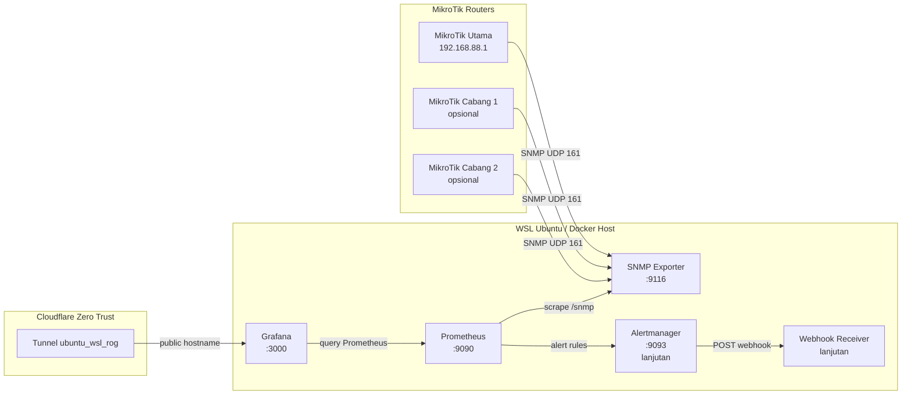

# Dashboard Observability Multi-Router MikroTik Berbasis Prometheus, Grafana, dan Automated Alerting Webhook

Dokumentasi ini menjelaskan langkah teknis pembuatan project monitoring jaringan MikroTik menggunakan **Docker**, **SNMP Exporter**, **Prometheus**, **Grafana**, dan rencana lanjutan **Alertmanager + Webhook**.

Project ini dibuat untuk kebutuhan monitoring multi-router MikroTik, dimulai dari satu router MikroTik utama:

```text
MikroTik utama : 192.168.88.1
RouterOS       : v6.49.9
Device         : MikroTik RB941-2nD / hAP lite
Environment    : WSL Ubuntu di laptop
Reverse proxy  : Cloudflare Zero Trust Tunnel
Tunnel name    : ubuntu_wsl_rog
```

---

## 1. Tujuan Project

Tujuan utama project ini adalah membuat sistem observability untuk router MikroTik yang mampu:

1. Membaca data router MikroTik menggunakan SNMP.
2. Mengubah data SNMP menjadi metrics Prometheus menggunakan SNMP Exporter.
3. Menyimpan metrics time-series di Prometheus.
4. Menampilkan dashboard visual di Grafana.
5. Mendukung monitoring banyak router MikroTik.
6. Menambahkan alert otomatis jika router/interface bermasalah.
7. Mengirim alert melalui webhook ke Telegram, WhatsApp, email, atau sistem lain.

---

## 2. Skema Arsitektur



Alur sederhananya:

```text
MikroTik 192.168.88.1
        ↓ SNMP UDP 161
SNMP Exporter
        ↓ HTTP metrics
Prometheus
        ↓ query
Grafana Dashboard
        ↓ tahap lanjutan
Alertmanager + Webhook
```

---

## 3. Komponen yang Digunakan

| Komponen | Fungsi |
|---|---|
| MikroTik | Router yang dimonitor |
| SNMP | Protokol untuk membaca data perangkat jaringan |
| SNMP Exporter | Mengubah data SNMP menjadi metrics format Prometheus |
| Prometheus | Menyimpan metrics dan melakukan scraping berkala |
| Grafana | Menampilkan dashboard monitoring |
| Alertmanager | Mengatur dan mengirim alert, tahap lanjutan |
| Webhook Receiver | Menerima alert dan meneruskan ke Telegram/WhatsApp/email, tahap lanjutan |
| Docker Compose | Menjalankan semua service dengan rapi |
| Cloudflare Zero Trust | Membuat Grafana bisa diakses online tanpa membuka port publik langsung |

---

## 4. Struktur Folder Project

Struktur folder yang digunakan:

```text
grafana_monitoring_mikrotik/
├── docker-compose.yml
├── prometheus/
│   └── prometheus.yml
├── snmp-exporter/
│   └── snmp.yml
├── grafana/
│   └── provisioning/
│       ├── datasources/
│       └── dashboards/
└── README.md
```

Untuk tahap awal, file yang wajib ada:

```text
docker-compose.yml
prometheus/prometheus.yml
snmp-exporter/snmp.yml
```

---

## 5. Persiapan MikroTik

### 5.1 Cek IP MikroTik

Dari WinBox, buka:

```text
IP > Addresses
```

Pada project ini, IP utama MikroTik yang digunakan adalah:

```text
192.168.88.1
```

Pastikan IP tersebut bisa diakses dari WSL Ubuntu.

Dari WSL Ubuntu:

```bash
ping -c 4 192.168.88.1
```

Contoh hasil berhasil:

```text
64 bytes from 192.168.88.1: icmp_seq=1 ttl=63 time=0.598 ms
64 bytes from 192.168.88.1: icmp_seq=2 ttl=63 time=0.537 ms
64 bytes from 192.168.88.1: icmp_seq=3 ttl=63 time=0.640 ms
64 bytes from 192.168.88.1: icmp_seq=4 ttl=63 time=0.474 ms

4 packets transmitted, 4 received, 0% packet loss
```

Jika ping berhasil, artinya WSL Ubuntu sudah bisa menjangkau MikroTik.

---

### 5.2 Aktifkan SNMP di MikroTik

Masuk ke WinBox, lalu buka:

```text
New Terminal
```

Jalankan:

```rsc
/snmp set enabled=yes contact="admin" location="Lab Monitoring MikroTik"
```

Cek status SNMP:

```rsc
/snmp print
```

---

### 5.3 Buat Community SNMP

Untuk kebutuhan monitoring, gunakan community read-only.

Contoh community:

```text
monitoring123
```

Jalankan di terminal MikroTik:

```rsc
/snmp community add name=monitoring123 addresses=192.168.88.0/24 read-access=yes write-access=no
```

Jika muncul error seperti ini:

```text
failure: community with the same name already exists!
```

Artinya community tersebut sudah pernah dibuat. Maka cukup update saja:

```rsc
/snmp community set [find name="monitoring123"] addresses=192.168.88.0/24 read-access=yes write-access=no
```

Cek detail community:

```rsc
/snmp community print detail
```

---

### 5.4 Firewall MikroTik untuk SNMP

Jika firewall MikroTik aktif, izinkan SNMP dari jaringan lokal:

```rsc
/ip firewall filter add chain=input protocol=udp dst-port=161 src-address=192.168.88.0/24 action=accept comment="Allow SNMP from monitoring subnet"
```

Catatan:

- SNMP menggunakan port **UDP 161**.
- Jangan membuka SNMP ke publik.
- Batasi hanya dari IP/jaringan monitoring.

Untuk testing sementara bisa memakai:

```rsc
/snmp community set [find name="monitoring123"] addresses=0.0.0.0/0 read-access=yes write-access=no
```

Namun setelah berhasil, sebaiknya dikunci kembali ke subnet lokal:

```rsc
/snmp community set [find name="monitoring123"] addresses=192.168.88.0/24 read-access=yes write-access=no
```

---

## 6. Persiapan WSL Ubuntu

### 6.1 Masuk ke folder project

```bash
cd ~/grafana_monitoring_mikrotik
```

Jika folder belum ada:

```bash
mkdir -p ~/grafana_monitoring_mikrotik
cd ~/grafana_monitoring_mikrotik
```

---

### 6.2 Install tool SNMP untuk testing

```bash
sudo apt update
sudo apt install -y snmp
```

Jika `apt update` bermasalah karena IPv6, paksa APT menggunakan IPv4:

```bash
echo 'Acquire::ForceIPv4 "true";' | sudo tee /etc/apt/apt.conf.d/99force-ipv4
sudo apt update
```

---

### 6.3 Test SNMP dari WSL ke MikroTik

Jalankan:

```bash
snmpwalk -v2c -c monitoring123 192.168.88.1 1.3.6.1.2.1.1.1.0
```

Jika berhasil, output akan seperti ini:

```text
iso.3.6.1.2.1.1.1.0 = STRING: "RouterOS RB941-2nD"
```

Jika output tersebut muncul, artinya:

```text
WSL Ubuntu → MikroTik SNMP = BERHASIL
```

---

## 7. Setup Docker Compose

### 7.1 Buat folder config

```bash
mkdir -p prometheus snmp-exporter grafana
```

---

### 7.2 Buat file docker-compose.yml

Buat file:

```bash
nano docker-compose.yml
```

Isi dengan konfigurasi berikut:

```yaml
services:
  snmp_exporter:
    image: prom/snmp-exporter:latest
    container_name: mikrotik_snmp_exporter
    restart: unless-stopped
    ports:
      - "9116:9116"
    volumes:
      - ./snmp-exporter/snmp.yml:/etc/snmp_exporter/snmp.yml:ro

  prometheus:
    image: prom/prometheus:latest
    container_name: mikrotik_prometheus
    restart: unless-stopped
    ports:
      - "9090:9090"
    command:
      - "--config.file=/etc/prometheus/prometheus.yml"
      - "--storage.tsdb.retention.time=30d"
    volumes:
      - ./prometheus/prometheus.yml:/etc/prometheus/prometheus.yml:ro
      - prometheus_data:/prometheus
    depends_on:
      - snmp_exporter

  grafana:
    image: grafana/grafana:latest
    container_name: mikrotik_grafana
    restart: unless-stopped
    ports:
      - "3000:3000"
    environment:
      - GF_SECURITY_ADMIN_USER=admin
      - GF_SECURITY_ADMIN_PASSWORD=admin12345
      - GF_USERS_ALLOW_SIGN_UP=false
    volumes:
      - grafana_data:/var/lib/grafana
    depends_on:
      - prometheus

volumes:
  prometheus_data:
  grafana_data:
```

Port yang digunakan:

| Service | Port |
|---|---|
| SNMP Exporter | 9116 |
| Prometheus | 9090 |
| Grafana | 3000 |

---

## 8. Setup SNMP Exporter

### 8.1 Ambil file snmp.yml default dari image Docker

Jalankan:

```bash
docker run --rm --entrypoint cat prom/snmp-exporter:latest /etc/snmp_exporter/snmp.yml > snmp-exporter/snmp.yml
```

Cek file:

```bash
ls -lh snmp-exporter/snmp.yml
head -40 snmp-exporter/snmp.yml
```

Jika file berhasil dibuat, ukurannya biasanya cukup besar karena berisi banyak module SNMP.

---

### 8.2 Ubah community public menjadi monitoring123

Jalankan:

```bash
sed -i '0,/community: public/s/community: public/community: monitoring123/' snmp-exporter/snmp.yml
```

Cek hasilnya:

```bash
grep -n "community:" snmp-exporter/snmp.yml | head
```

Output yang diharapkan:

```text
4:    community: monitoring123
10:    community: public
```

Keterangan:

- `public_v1` berubah menjadi `monitoring123`.
- `public_v2` masih public jika hanya baris pertama yang diganti.

Agar lebih rapi, ubah juga bagian `public_v2` secara manual.

Edit file:

```bash
nano snmp-exporter/snmp.yml
```

Cari bagian:

```yaml
auths:
  public_v1:
    community: monitoring123
    security_level: noAuthNoPriv
    auth_protocol: MD5
    priv_protocol: DES
    version: 1
  public_v2:
    community: public
    security_level: noAuthNoPriv
    auth_protocol: MD5
    priv_protocol: DES
    version: 2
```

Ubah menjadi:

```yaml
auths:
  public_v1:
    community: monitoring123
    security_level: noAuthNoPriv
    auth_protocol: MD5
    priv_protocol: DES
    version: 1
  public_v2:
    community: monitoring123
    security_level: noAuthNoPriv
    auth_protocol: MD5
    priv_protocol: DES
    version: 2
```

Simpan file.

---

## 9. Setup Prometheus

Buat file:

```bash
nano prometheus/prometheus.yml
```

Isi:

```yaml
global:
  scrape_interval: 15s
  evaluation_interval: 15s

scrape_configs:
  - job_name: "prometheus"
    static_configs:
      - targets:
          - "prometheus:9090"

  - job_name: "mikrotik_snmp"
    metrics_path: /snmp
    params:
      module:
        - if_mib
      auth:
        - public_v2
    static_configs:
      - targets:
          - 192.168.88.1
        labels:
          router: "mikrotik_hap_lite"
          location: "lab_wsl"
    relabel_configs:
      - source_labels: [__address__]
        target_label: __param_target

      - source_labels: [__param_target]
        target_label: instance

      - target_label: __address__
        replacement: snmp_exporter:9116
```

Penjelasan penting:

```yaml
targets:
  - 192.168.88.1
```

Itu adalah IP MikroTik yang dimonitor.

```yaml
replacement: snmp_exporter:9116
```

Artinya Prometheus tidak langsung scrape MikroTik, tetapi scrape ke SNMP Exporter.

Alurnya:

```text
Prometheus → snmp_exporter:9116/snmp?target=192.168.88.1
```

---

## 10. Jalankan Docker Stack

Jalankan:

```bash
docker compose up -d
```

Cek container:

```bash
docker ps
```

Container yang harus aktif:

```text
mikrotik_snmp_exporter
mikrotik_prometheus
mikrotik_grafana
```

Cek log jika perlu:

```bash
docker logs mikrotik_snmp_exporter --tail=50
docker logs mikrotik_prometheus --tail=50
docker logs mikrotik_grafana --tail=50
```

---

## 11. Test SNMP Exporter

Dari WSL:

```bash
curl "http://localhost:9116/snmp?target=192.168.88.1&module=if_mib&auth=public_v2" | head
```

Contoh output berhasil:

```text
# HELP ifAdminStatus The desired state of the interface
# TYPE ifAdminStatus gauge
ifAdminStatus{ifAlias="",ifDescr="ether1",ifIndex="1",ifName="ether1"} 1
ifAdminStatus{ifAlias="",ifDescr="ether2",ifIndex="2",ifName="ether2"} 1
ifAdminStatus{ifAlias="",ifDescr="ether3",ifIndex="3",ifName="ether3"} 1
ifAdminStatus{ifAlias="",ifDescr="ether4",ifIndex="4",ifName="ether4"} 1
ifAdminStatus{ifAlias="",ifDescr="pwr-line1",ifIndex="5",ifName="pwr-line1"} 1
ifAdminStatus{ifAlias="",ifDescr="wlan1",ifIndex="6",ifName="wlan1"} 2
```

Jika muncul pesan:

```text
curl: Failed writing body
```

Saat menggunakan `| head`, itu normal. Penyebabnya output metrics masih banyak, tetapi command `head` sudah menutup output.

---

## 12. Cek Prometheus

Buka browser:

```text
http://localhost:9090/targets
```

Pastikan target berikut statusnya **UP**:

```text
mikrotik_snmp
prometheus
```

Jika `mikrotik_snmp` sudah UP, artinya pipeline ini sudah berhasil:

```text
MikroTik → SNMP Exporter → Prometheus
```

Coba query di Prometheus:

```promql
up{job="mikrotik_snmp"}
```

Output yang diharapkan:

```text
1
```

---

## 13. Setup Grafana

### 13.1 Buka Grafana

Buka:

```text
http://localhost:3000
```

Login default:

```text
username: admin
password: admin12345
```

Sebaiknya setelah login, ganti password admin agar lebih aman.

---

### 13.2 Tambahkan Data Source Prometheus

Masuk ke menu:

```text
Connections > Data sources > Add data source
```

Pilih:

```text
Prometheus
```

Isi bagian Prometheus server URL:

```text
http://prometheus:9090
```

Penting:

Jangan memakai:

```text
http://localhost:9090
```

Alasannya:

```text
Grafana berjalan di dalam container.
Jika diisi localhost, maka localhost tersebut mengarah ke container Grafana,
bukan ke container Prometheus.
```

Karena container berada dalam satu network Docker Compose, Grafana harus mengakses Prometheus menggunakan nama service:

```text
http://prometheus:9090
```

Klik:

```text
Save & test
```

Jika berhasil, akan muncul pesan bahwa Grafana berhasil query Prometheus API.

---

## 14. Membuat Dashboard Grafana

Buat dashboard baru:

```text
Dashboards > New > New Dashboard
```

Nama dashboard:

```text
DASHBOARD MIKROTIK
```

---

### 14.1 Panel Status Router MikroTik

Query:

```promql
up{job="mikrotik_snmp"}
```

Visualization:

```text
Stat
```

Judul:

```text
Status Router MikroTik
```

Value mapping:

```text
1 = ONLINE
0 = DOWN
```

---

### 14.2 Panel Total Download Traffic

Query:

```promql
sum(rate(ifHCInOctets{job="mikrotik_snmp"}[5m]) * 8)
```

Visualization:

```text
Stat
```

Unit:

```text
bits/sec
```

Judul:

```text
Total Download Traffic
```

---

### 14.3 Panel Total Upload Traffic

Query:

```promql
sum(rate(ifHCOutOctets{job="mikrotik_snmp"}[5m]) * 8)
```

Visualization:

```text
Stat
```

Unit:

```text
bits/sec
```

Judul:

```text
Total Upload Traffic
```

---

### 14.4 Panel Download per Interface

Query:

```promql
rate(ifHCInOctets{job="mikrotik_snmp"}[5m]) * 8
```

Visualization:

```text
Time series
```

Unit:

```text
bits/sec
```

Legend:

```text
{{ifName}}
```

Judul:

```text
Download per Interface
```

---

### 14.5 Panel Upload per Interface

Query:

```promql
rate(ifHCOutOctets{job="mikrotik_snmp"}[5m]) * 8
```

Visualization:

```text
Time series
```

Unit:

```text
bits/sec
```

Legend:

```text
{{ifName}}
```

Judul:

```text
Upload per Interface
```

---

### 14.6 Panel Status Interface

Query:

```promql
ifOperStatus{job="mikrotik_snmp"}
```

Visualization:

```text
Table
```

Judul:

```text
Status Interface
```

Nilai:

```text
1 = UP
2 = DOWN
```

Jika ingin hanya melihat interface tertentu:

```promql
ifOperStatus{job="mikrotik_snmp", ifName="ether1"}
```

Atau untuk semua ethernet:

```promql
ifOperStatus{job="mikrotik_snmp", ifName=~"ether.*"}
```

---

## 15. Susunan Dashboard yang Disarankan

Layout awal:

```text
Baris 1:
[Status Router MikroTik] [Total Download Traffic] [Total Upload Traffic]

Baris 2:
[Status Interface]

Baris 3:
[Download per Interface]

Baris 4:
[Upload per Interface]
```

Jika ingin lebih rapi:

- Gunakan panel `Stat` untuk status dan total traffic.
- Gunakan `Time series` untuk traffic per interface.
- Gunakan `Table` untuk status interface.
- Gunakan legend `{{ifName}}`.
- Set unit traffic menjadi `bits/sec`.

---

## 16. Query PromQL Penting

### Status router

```promql
up{job="mikrotik_snmp"}
```

### Download per interface

```promql
rate(ifHCInOctets{job="mikrotik_snmp"}[5m]) * 8
```

### Upload per interface

```promql
rate(ifHCOutOctets{job="mikrotik_snmp"}[5m]) * 8
```

### Total download semua interface

```promql
sum(rate(ifHCInOctets{job="mikrotik_snmp"}[5m]) * 8)
```

### Total upload semua interface

```promql
sum(rate(ifHCOutOctets{job="mikrotik_snmp"}[5m]) * 8)
```

### Status interface

```promql
ifOperStatus{job="mikrotik_snmp"}
```

### Interface yang down

```promql
ifOperStatus{job="mikrotik_snmp"} == 2
```

### Traffic ether1 download

```promql
rate(ifHCInOctets{job="mikrotik_snmp", ifName="ether1"}[5m]) * 8
```

### Traffic ether1 upload

```promql
rate(ifHCOutOctets{job="mikrotik_snmp", ifName="ether1"}[5m]) * 8
```

---

## 17. Cloudflare Zero Trust

Pada project ini WSL Ubuntu sudah dihubungkan ke Cloudflare Zero Trust menggunakan tunnel:

```text
ubuntu_wsl_rog
```

Yang sebaiknya di-expose ke internet hanya Grafana:

```text
Service type : HTTP
URL          : http://localhost:3000
```

Jangan expose service berikut ke publik:

```text
Prometheus    : http://localhost:9090
SNMP Exporter : http://localhost:9116
Alertmanager  : http://localhost:9093
```

Rekomendasi:

1. Public hostname diarahkan ke Grafana.
2. Grafana diberi login yang kuat.
3. Cloudflare Access bisa ditambahkan supaya hanya email tertentu yang bisa masuk.
4. Jangan commit token cloudflared ke GitHub.
5. Jangan upload screenshot token tunnel ke publik.

---

## 18. Menambah Router MikroTik Baru

Jika nanti ingin monitoring banyak router, tambahkan IP baru di `prometheus/prometheus.yml`.

Contoh:

```yaml
  - job_name: "mikrotik_snmp"
    metrics_path: /snmp
    params:
      module:
        - if_mib
      auth:
        - public_v2
    static_configs:
      - targets:
          - 192.168.88.1
          - 192.168.89.1
          - 192.168.90.1
        labels:
          location: "multi_router"
    relabel_configs:
      - source_labels: [__address__]
        target_label: __param_target

      - source_labels: [__param_target]
        target_label: instance

      - target_label: __address__
        replacement: snmp_exporter:9116
```

Setelah mengubah config, restart Prometheus:

```bash
docker compose restart prometheus
```

Cek target:

```text
http://localhost:9090/targets
```

---

## 19. Rencana Tahap Lanjutan: Alertmanager

Setelah dashboard berhasil, tahap berikutnya adalah automated alerting.

Alert yang disarankan:

| Alert | Kondisi |
|---|---|
| RouterDown | Router tidak bisa di-scrape |
| InterfaceDown | Interface penting down |
| HighTraffic | Traffic melewati batas tertentu |
| NoTraffic | Interface utama tiba-tiba tidak ada traffic |
| RebootDetected | Uptime berubah drastis |
| SNMPExporterDown | SNMP Exporter mati |
| PrometheusDown | Prometheus bermasalah |

Contoh alert rule router down:

```yaml
groups:
  - name: mikrotik-alerts
    rules:
      - alert: MikroTikRouterDown
        expr: up{job="mikrotik_snmp"} == 0
        for: 1m
        labels:
          severity: critical
        annotations:
          summary: "MikroTik router down"
          description: "Router {{ $labels.instance }} tidak bisa diakses oleh Prometheus selama lebih dari 1 menit."
```

Contoh alert interface down:

```yaml
groups:
  - name: mikrotik-interface-alerts
    rules:
      - alert: MikroTikInterfaceDown
        expr: ifOperStatus{job="mikrotik_snmp", ifName="ether1"} == 2
        for: 1m
        labels:
          severity: warning
        annotations:
          summary: "Interface ether1 down"
          description: "Interface {{ $labels.ifName }} pada router {{ $labels.instance }} sedang DOWN."
```

---

## 20. Rencana Tahap Lanjutan: Webhook Receiver

Setelah Alertmanager aktif, alert bisa dikirim ke webhook custom.

Contoh alur:

```text
Prometheus Alert Rules
        ↓
Alertmanager
        ↓ HTTP POST
Webhook Receiver
        ↓
Telegram / WhatsApp / Email / Database
```

Webhook receiver bisa dibuat memakai:

- FastAPI
- Laravel
- Node.js
- Go

Untuk project ini, opsi yang sederhana adalah FastAPI.

Contoh endpoint:

```text
POST /webhook/alert
```

Payload dari Alertmanager bisa diproses lalu dikirim ke Telegram/WhatsApp.

---

## 21. Troubleshooting

### 21.1 Ping MikroTik gagal

Cek:

```bash
ping -c 4 192.168.88.1
```

Jika gagal:

- Pastikan WSL/laptop satu jaringan dengan MikroTik.
- Cek IP MikroTik di WinBox.
- Cek adapter jaringan Windows.
- Cek firewall Windows.

---

### 21.2 SNMPWalk timeout

Command:

```bash
snmpwalk -v2c -c monitoring123 192.168.88.1 1.3.6.1.2.1.1.1.0
```

Jika timeout:

- SNMP belum aktif.
- Community salah.
- Firewall MikroTik belum allow UDP 161.
- IP WSL tidak termasuk allowed addresses di community.
- Router tidak bisa dijangkau.

Perintah perbaikan di MikroTik:

```rsc
/snmp set enabled=yes
/snmp community set [find name="monitoring123"] addresses=192.168.88.0/24 read-access=yes write-access=no
/ip firewall filter add chain=input protocol=udp dst-port=161 src-address=192.168.88.0/24 action=accept comment="Allow SNMP from monitoring subnet"
```

---

### 21.3 Docker gagal pull image

Cek internet:

```bash
ping -c 4 google.com
```

Cek Docker:

```bash
docker version
docker compose version
```

Jika APT sering error IPv6:

```bash
echo 'Acquire::ForceIPv4 "true";' | sudo tee /etc/apt/apt.conf.d/99force-ipv4
sudo apt update
```

---

### 21.4 Prometheus target DOWN

Buka:

```text
http://localhost:9090/targets
```

Jika `mikrotik_snmp` DOWN, cek:

```bash
docker logs mikrotik_prometheus --tail=100
docker logs mikrotik_snmp_exporter --tail=100
```

Test langsung SNMP Exporter:

```bash
curl "http://localhost:9116/snmp?target=192.168.88.1&module=if_mib&auth=public_v2" | head
```

Jika SNMP Exporter berhasil tetapi Prometheus DOWN, kemungkinan `prometheus.yml` salah.

---

### 21.5 Grafana datasource gagal

Jika datasource memakai:

```text
http://localhost:9090
```

Ganti menjadi:

```text
http://prometheus:9090
```

Karena Grafana dan Prometheus sama-sama berjalan di Docker Compose network.

---

### 21.6 Dashboard kosong

Cek query di Grafana Explore:

```promql
up{job="mikrotik_snmp"}
```

Jika hasilnya kosong:

- Datasource salah.
- Prometheus belum scrape target.
- Job name salah.
- Time range Grafana terlalu sempit.

Set time range ke:

```text
Last 15 minutes
```

atau:

```text
Last 6 hours
```

---

## 22. Perintah Cepat Harian

Masuk project:

```bash
cd ~/grafana_monitoring_mikrotik
```

Jalankan stack:

```bash
docker compose up -d
```

Stop stack:

```bash
docker compose down
```

Restart semua:

```bash
docker compose restart
```

Cek container:

```bash
docker ps
```

Cek logs:

```bash
docker logs mikrotik_prometheus --tail=50
docker logs mikrotik_snmp_exporter --tail=50
docker logs mikrotik_grafana --tail=50
```

Cek target Prometheus:

```text
http://localhost:9090/targets
```

Buka Grafana:

```text
http://localhost:3000
```

---

## 23. Status Project Saat Ini

Status terakhir project:

```text
Ping WSL ke MikroTik          : BERHASIL
SNMP MikroTik                 : BERHASIL
SNMPWalk dari WSL             : BERHASIL
SNMP Exporter                 : BERHASIL
Prometheus target mikrotik    : UP
Grafana datasource Prometheus : BERHASIL
Dashboard basic Grafana       : BERHASIL
```

Dashboard saat ini sudah menampilkan:

```text
- Status Router MikroTik
- Total Download Traffic
- Total Upload Traffic
- Status Interface
- Download per Interface
```

Tahap berikutnya:

```text
1. Rapikan dashboard Grafana
2. Export dashboard JSON
3. Tambahkan Alertmanager
4. Tambahkan alert rules
5. Buat webhook receiver
6. Kirim alert ke Telegram/WhatsApp/email
7. Tambahkan dokumentasi deployment final
```

---

## 24. Catatan Keamanan

1. Jangan membuka SNMP ke internet.
2. Jangan expose Prometheus dan SNMP Exporter ke publik.
3. Expose hanya Grafana melalui Cloudflare Zero Trust.
4. Gunakan password Grafana yang kuat.
5. Gunakan Cloudflare Access untuk membatasi akses dashboard.
6. Jangan commit token Cloudflare Tunnel.
7. Jangan commit file `.env` yang berisi secret.
8. Untuk produksi, pertimbangkan SNMP v3 agar lebih aman daripada SNMP v2c.

---

## 25. Kesimpulan

Project ini sudah berhasil membangun fondasi observability MikroTik berbasis Docker:

```text
MikroTik → SNMP Exporter → Prometheus → Grafana
```

Dengan fondasi ini, sistem dapat dikembangkan menjadi dashboard monitoring multi-router lengkap dengan automated alerting webhook.

Judul project:

```text
Dashboard Observability Multi-Router MikroTik Berbasis Prometheus, Grafana, dan Automated Alerting Webhook
```

sudah sesuai dengan arsitektur yang dibangun, karena mencakup:

```text
Observability   : metrics, dashboard, status, traffic
Multi-Router    : mendukung banyak IP MikroTik
Prometheus      : metrics collector dan time-series database
Grafana         : visualisasi dashboard
Alerting        : Prometheus alert rules + Alertmanager
Webhook         : pengiriman alert otomatis ke sistem eksternal
Docker          : deployment aman, rapi, dan mudah dipindahkan
```
