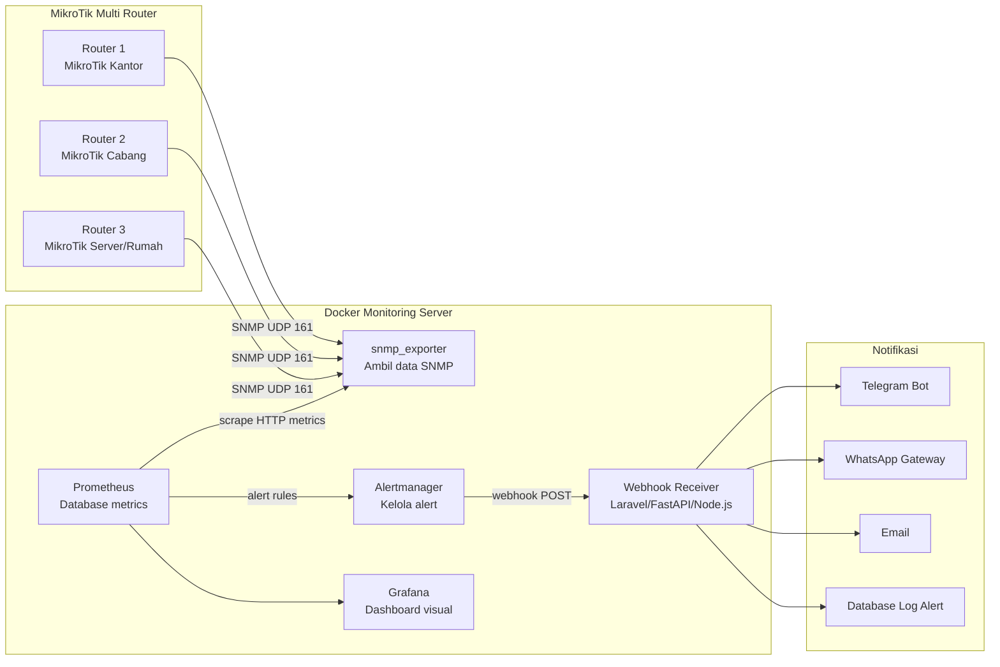
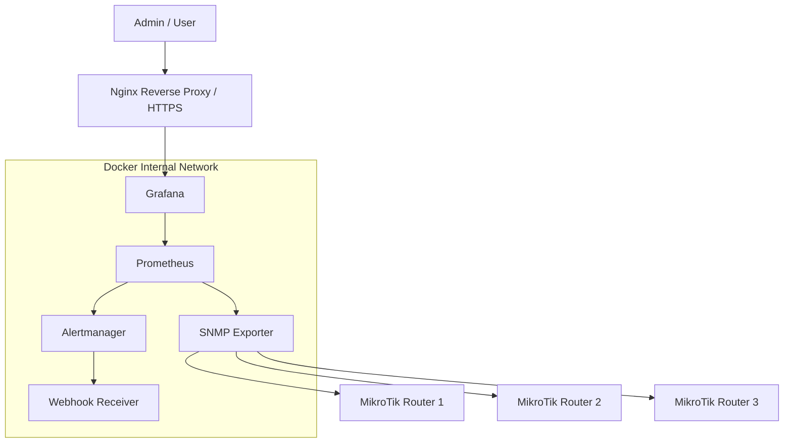
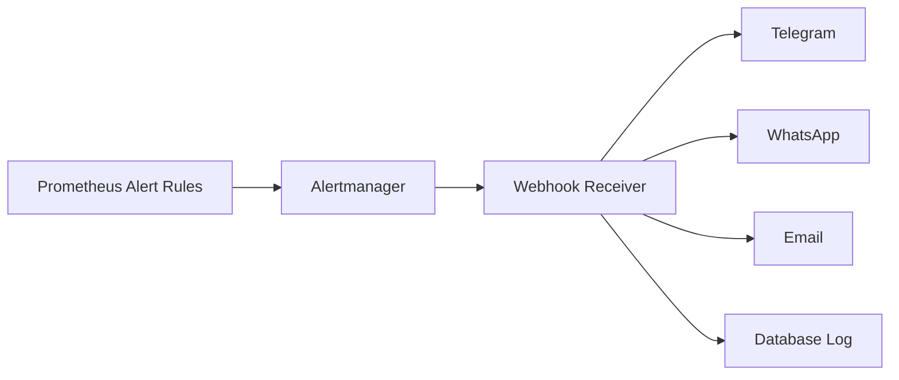

# Dashboard Observability Multi-Router MikroTik

## Judul Project

**Dashboard Observability Multi-Router MikroTik Berbasis Prometheus, Grafana, dan Automated Alerting Webhook**

---

## 1. Gambaran Umum Project

Project ini dibuat untuk membangun sistem monitoring jaringan berbasis Docker yang dapat memantau banyak router MikroTik secara terpusat.

Sistem ini menggunakan beberapa komponen utama:

- **MikroTik Router** sebagai perangkat jaringan yang dimonitor.
- **SNMP Exporter** sebagai pengambil data SNMP dari MikroTik.
- **Prometheus** sebagai penyimpan dan pengolah data metrics.
- **Grafana** sebagai dashboard visual monitoring.
- **Alertmanager** sebagai pengelola alert.
- **Webhook Receiver** sebagai penerima alert otomatis untuk diteruskan ke Telegram, WhatsApp, email, atau database log.

Dengan skema ini, admin jaringan dapat melihat kondisi banyak router dari satu dashboard, menerima notifikasi otomatis saat terjadi gangguan, dan menyimpan histori monitoring secara lebih rapi.

---

## 2. Tujuan Project

Tujuan utama dari project ini adalah:

1. Membuat sistem monitoring multi-router MikroTik secara terpusat.
2. Menampilkan metrics jaringan dalam bentuk dashboard Grafana.
3. Mengumpulkan data router menggunakan Prometheus.
4. Menggunakan Docker agar deployment lebih aman, rapi, dan mudah dipindahkan.
5. Membuat sistem alert otomatis ketika router/interface mengalami gangguan.
6. Mengirim alert melalui webhook ke layanan eksternal seperti Telegram, WhatsApp, email, atau sistem internal.
7. Menyediakan dasar observability jaringan yang dapat dikembangkan lebih lanjut.

---

## 3. Arsitektur Sistem

Skema besar sistem yang akan dibangun:



---

## 4. Alur Kerja Sistem

Alur kerja monitoring berjalan seperti berikut:

1. MikroTik mengaktifkan SNMP read-only.
2. SNMP Exporter membaca metrics dari router MikroTik menggunakan SNMP.
3. Prometheus melakukan scrape ke SNMP Exporter secara berkala.
4. Data metrics disimpan oleh Prometheus sebagai time-series database.
5. Grafana mengambil data dari Prometheus untuk ditampilkan sebagai dashboard.
6. Prometheus menjalankan alert rules berdasarkan kondisi tertentu.
7. Jika ada masalah, Prometheus mengirim alert ke Alertmanager.
8. Alertmanager mengatur routing alert dan mengirimkannya ke Webhook Receiver.
9. Webhook Receiver meneruskan alert ke Telegram, WhatsApp, email, atau database log.

---

## 5. Komponen Utama

### 5.1 MikroTik Router

MikroTik Router menjadi sumber data monitoring.

Data yang akan diambil antara lain:

- Status router aktif atau down.
- Uptime router.
- CPU load.
- Memory usage.
- Traffic upload/download.
- Status interface.
- Interface error/drop.
- Indikasi reboot router.
- Health metrics jika perangkat mendukung.

---

### 5.2 SNMP Exporter

SNMP Exporter berfungsi sebagai jembatan antara MikroTik dan Prometheus.

Prometheus tidak membaca data SNMP langsung ke router. Prometheus akan membaca endpoint HTTP milik SNMP Exporter, lalu SNMP Exporter yang akan mengambil data dari MikroTik.

Alur sederhananya:

```text
Prometheus -> SNMP Exporter -> MikroTik Router
```

---

### 5.3 Prometheus

Prometheus digunakan untuk:

- Menyimpan metrics router.
- Melakukan scrape metrics secara berkala.
- Menjalankan query PromQL.
- Menjalankan alert rules.
- Mengirim alert ke Alertmanager.

Contoh data yang akan disimpan:

```text
router_up
cpu_usage
memory_usage
interface_status
interface_traffic_rx
interface_traffic_tx
interface_error
router_uptime
```

---

### 5.4 Grafana

Grafana digunakan sebagai dashboard visual.

Grafana akan menampilkan:

- Overview semua router.
- Detail masing-masing router.
- Traffic interface.
- CPU dan RAM router.
- Status interface.
- Alert aktif.
- Riwayat performa jaringan.

---

### 5.5 Alertmanager

Alertmanager digunakan untuk mengelola alert dari Prometheus.

Fungsinya:

- Menerima alert dari Prometheus.
- Mengelompokkan alert.
- Mengatur severity alert.
- Mengirim alert ke webhook.
- Menghindari spam notifikasi.
- Mengirim status firing dan resolved.

---

### 5.6 Webhook Receiver

Webhook Receiver adalah service custom untuk menerima alert dari Alertmanager.

Webhook ini bisa dibuat menggunakan:

- Laravel
- FastAPI
- Node.js
- Go
- PHP native

Untuk project ini, webhook dapat diarahkan ke:

- Telegram Bot
- WhatsApp Gateway
- Email
- Database log
- Dashboard internal

Contoh endpoint:

```text
POST http://webhook-receiver:8080/webhook/alert
```

---

## 6. Skema Docker Service

Semua komponen akan dijalankan menggunakan Docker Compose.

Service yang akan digunakan:

| Service | Port Internal | Port External | Fungsi |
|---|---:|---:|---|
| Prometheus | 9090 | Opsional | Metrics database |
| Grafana | 3000 | 3000 / Reverse Proxy | Dashboard monitoring |
| SNMP Exporter | 9116 | Opsional | Exporter SNMP ke Prometheus |
| Alertmanager | 9093 | Opsional | Pengelola alert |
| Webhook Receiver | 8080 | Opsional | Penerima alert webhook |

Rekomendasi akses:

- Grafana boleh diakses oleh admin.
- Prometheus sebaiknya tidak dibuka publik.
- Alertmanager sebaiknya tidak dibuka publik.
- SNMP Exporter sebaiknya tidak dibuka publik.
- Webhook Receiver sebaiknya hanya diakses dari Alertmanager atau diberi secret token.

---

## 7. Struktur Folder Project

Struktur folder yang direkomendasikan:

```text
mikrotik-observability/
├── README.md
├── docker-compose.yml
├── .env
│
├── prometheus/
│   ├── prometheus.yml
│   └── alert-rules.yml
│
├── snmp-exporter/
│   └── snmp.yml
│
├── alertmanager/
│   └── alertmanager.yml
│
├── grafana/
│   ├── provisioning/
│   │   ├── datasources/
│   │   │   └── prometheus.yml
│   │   └── dashboards/
│   │       └── dashboards.yml
│   │
│   └── dashboards/
│       └── mikrotik-dashboard.json
│
└── webhook-receiver/
    ├── Dockerfile
    ├── app.py
    └── requirements.txt
```

---

## 8. Skema Jaringan Docker

Skema jaringan Docker yang direkomendasikan:



Prinsip jaringan:

- Admin hanya perlu membuka Grafana.
- Service lain cukup berjalan secara internal.
- Prometheus dan Alertmanager tidak perlu dibuka ke internet.
- Akses SNMP dari router dibatasi hanya untuk IP server monitoring.

---

## 9. Metrics yang Akan Dipantau

Metrics utama yang akan dimonitor:

### 9.1 Router Health

- Router online/down.
- Uptime router.
- CPU usage.
- Memory usage.
- Reboot detection.

### 9.2 Interface Monitoring

- Interface up/down.
- Traffic RX.
- Traffic TX.
- Bandwidth usage.
- Packet error.
- Packet drop.
- Top interface by traffic.

### 9.3 Availability

- Router tidak bisa diakses.
- SNMP tidak merespons.
- Interface utama mati.
- Router reboot tiba-tiba.

### 9.4 Performance

- CPU terlalu tinggi.
- Memory hampir penuh.
- Traffic terlalu tinggi.
- Traffic drop tidak normal.

---

## 10. Konsep Dashboard Grafana

Dashboard Grafana dibagi menjadi beberapa bagian.

### 10.1 Dashboard Overview Multi-Router

Berisi ringkasan semua router:

- Total router.
- Router online.
- Router down.
- Total interface up.
- Total interface down.
- CPU rata-rata.
- Memory rata-rata.
- Total traffic download.
- Total traffic upload.
- Alert aktif.

---

### 10.2 Dashboard Detail Router

Berisi detail per router:

- Nama router.
- IP router.
- Uptime.
- CPU usage.
- Memory usage.
- Traffic per interface.
- Interface status.
- Error packet.
- Reboot history.

---

### 10.3 Dashboard Interface Monitoring

Berisi detail interface:

- Status interface.
- Traffic RX/TX.
- Bandwidth usage.
- Interface paling sibuk.
- Interface yang sering down.
- Error dan drop packet.

---

### 10.4 Dashboard Alerting

Berisi kondisi alert:

- Alert aktif.
- Alert resolved.
- Router bermasalah.
- Severity alert.
- Waktu kejadian.
- Jumlah alert per router.

---

## 11. Konsep Alerting

Alert akan dibuat berdasarkan kondisi tertentu.

Contoh alert yang akan digunakan:

| Alert | Kondisi | Severity |
|---|---|---|
| RouterDown | Router tidak merespons | Critical |
| InterfaceDown | Interface utama mati | Warning/Critical |
| HighCPUUsage | CPU lebih dari 80% selama 5 menit | Warning |
| HighMemoryUsage | Memory lebih dari 85% | Warning |
| RouterRebooted | Uptime berubah drastis | Warning |
| HighTrafficUsage | Traffic interface terlalu tinggi | Warning |
| SNMPExporterDown | SNMP Exporter mati | Critical |

---

## 12. Skema Alert Webhook

Alur alert webhook:



Contoh payload alert dari Alertmanager akan berisi informasi seperti:

```json
{
  "status": "firing",
  "alerts": [
    {
      "labels": {
        "alertname": "RouterDown",
        "severity": "critical",
        "instance": "router-kantor"
      },
      "annotations": {
        "summary": "Router kantor tidak merespons",
        "description": "Router kantor tidak dapat diakses oleh Prometheus."
      },
      "startsAt": "2026-05-20T10:00:00Z"
    }
  ]
}
```

Webhook Receiver dapat mengubah payload tersebut menjadi pesan notifikasi seperti:

```text
🚨 ALERT CRITICAL

Alert      : RouterDown
Router     : router-kantor
Status     : firing
Keterangan : Router kantor tidak merespons
Waktu      : 2026-05-20 17:00 WIB
```

---

## 13. Skema Keamanan

Keamanan yang direkomendasikan:

1. Gunakan SNMP read-only.
2. Batasi akses SNMP hanya dari IP server monitoring.
3. Jangan expose Prometheus ke internet.
4. Jangan expose Alertmanager ke internet.
5. Jangan expose SNMP Exporter ke internet.
6. Grafana wajib menggunakan username dan password kuat.
7. Gunakan Nginx reverse proxy + HTTPS untuk Grafana.
8. Gunakan secret token pada endpoint webhook.
9. Gunakan Docker network internal.
10. Simpan credential di file `.env`.
11. Backup konfigurasi Grafana dan Prometheus.
12. Untuk produksi, pertimbangkan SNMP v3.

---

## 14. Contoh Environment Variable

Contoh isi file `.env`:

```env
TZ=Asia/Jakarta

GRAFANA_ADMIN_USER=admin
GRAFANA_ADMIN_PASSWORD=ChangeThisStrongPassword

WEBHOOK_SECRET=change-this-secret-token

TELEGRAM_BOT_TOKEN=
TELEGRAM_CHAT_ID=

WHATSAPP_GATEWAY_URL=
WHATSAPP_GATEWAY_TOKEN=

SMTP_HOST=
SMTP_PORT=587
SMTP_USER=
SMTP_PASSWORD=
SMTP_FROM=
```

---

## 15. Rencana Tahapan Pengerjaan

Tahapan pengerjaan project:

### Tahap 1 - Persiapan Router

- Aktifkan SNMP di MikroTik.
- Buat community/user monitoring.
- Batasi akses SNMP dari IP server monitoring.
- Tentukan daftar router yang akan dimonitor.

### Tahap 2 - Persiapan Docker Stack

- Buat folder project.
- Buat `docker-compose.yml`.
- Jalankan Prometheus.
- Jalankan SNMP Exporter.
- Jalankan Grafana.
- Jalankan Alertmanager.
- Jalankan Webhook Receiver.

### Tahap 3 - Konfigurasi Prometheus

- Tambahkan target router MikroTik.
- Tambahkan job SNMP Exporter.
- Tambahkan alert rules.
- Test scrape target.

### Tahap 4 - Konfigurasi Grafana

- Tambahkan datasource Prometheus.
- Import dashboard MikroTik.
- Buat dashboard custom.
- Buat panel overview multi-router.

### Tahap 5 - Konfigurasi Alerting

- Buat rule alert Prometheus.
- Hubungkan Prometheus ke Alertmanager.
- Hubungkan Alertmanager ke Webhook Receiver.
- Test alert firing dan resolved.

### Tahap 6 - Integrasi Notifikasi

- Integrasi Telegram.
- Integrasi WhatsApp Gateway jika tersedia.
- Integrasi email jika diperlukan.
- Simpan log alert ke database jika diperlukan.

### Tahap 7 - Hardening dan Dokumentasi

- Tambahkan reverse proxy HTTPS.
- Tambahkan authentication.
- Amankan endpoint webhook.
- Buat dokumentasi konfigurasi.
- Buat backup konfigurasi.

---

## 16. Contoh Daftar Router

Contoh daftar router yang akan dimonitor:

| Nama Router | IP Address | Lokasi | Keterangan |
|---|---|---|---|
| router-kantor | 192.168.10.1 | Kantor | Router utama kantor |
| router-cabang-1 | 192.168.20.1 | Cabang 1 | Router cabang |
| router-server-rumah | 10.77.77.3 | Rumah/Server | Router jaringan internal |

Format ini nanti akan dimasukkan ke konfigurasi Prometheus.

---

## 17. Port yang Digunakan

| Komponen | Port | Keterangan |
|---|---:|---|
| MikroTik SNMP | UDP 161 | Akses SNMP dari monitoring server |
| Prometheus | TCP 9090 | Web UI Prometheus |
| Grafana | TCP 3000 | Dashboard Grafana |
| SNMP Exporter | TCP 9116 | Endpoint metrics SNMP |
| Alertmanager | TCP 9093 | Web UI Alertmanager |
| Webhook Receiver | TCP 8080 | Endpoint penerima alert |

Rekomendasi expose:

- Expose hanya Grafana ke publik.
- Service lain cukup internal Docker atau hanya dibuka untuk admin/VPN.

---

## 18. Output Akhir yang Diharapkan

Output akhir dari project ini:

1. Docker Compose monitoring stack.
2. Prometheus berjalan dan scrape banyak router MikroTik.
3. Grafana dashboard multi-router.
4. Alert rules untuk gangguan jaringan.
5. Alertmanager mengirim alert otomatis.
6. Webhook Receiver menerima alert.
7. Notifikasi otomatis ke Telegram/WhatsApp/email.
8. Dokumentasi lengkap untuk instalasi, konfigurasi, dan maintenance.

---

## 19. Catatan Penting

Project ini sebaiknya dikembangkan bertahap.

Urutan paling aman:

```text
1. Jalankan Docker stack lokal
2. Aktifkan SNMP di 1 router MikroTik
3. Test SNMP Exporter
4. Test Prometheus scrape
5. Test Grafana dashboard
6. Tambahkan router kedua dan seterusnya
7. Tambahkan alert rules
8. Tambahkan webhook notification
9. Tambahkan reverse proxy + HTTPS
10. Hardening keamanan
```

Jangan langsung membuka semua port ke publik. Pastikan hanya dashboard Grafana yang diakses dari luar, sementara komponen monitoring lainnya tetap internal.

---

## 20. Ringkasan Arsitektur Final

Arsitektur final project:

```text
MikroTik Router
      ↓
SNMP Exporter
      ↓
Prometheus
      ↓
Grafana Dashboard
      ↓
Prometheus Alert Rules
      ↓
Alertmanager
      ↓
Webhook Receiver
      ↓
Telegram / WhatsApp / Email / Database Log
```

Dengan arsitektur ini, project sudah memenuhi konsep:

- **Observability**
- **Multi-Router Monitoring**
- **Prometheus Metrics**
- **Grafana Dashboard**
- **Automated Alerting**
- **Webhook Integration**
- **Dockerized Deployment**
- **Network Monitoring Security**
